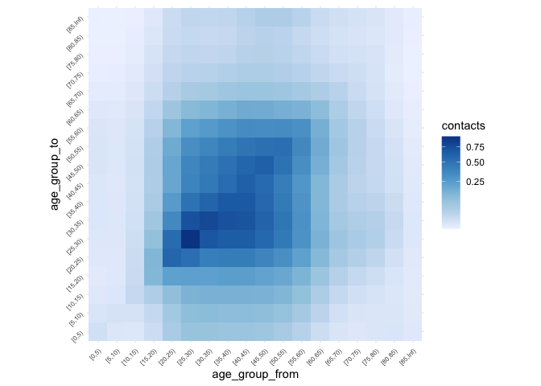
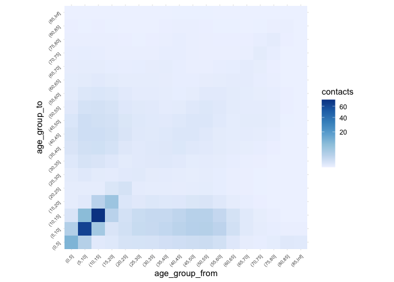
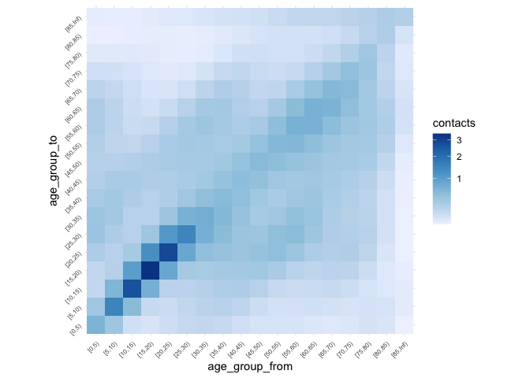
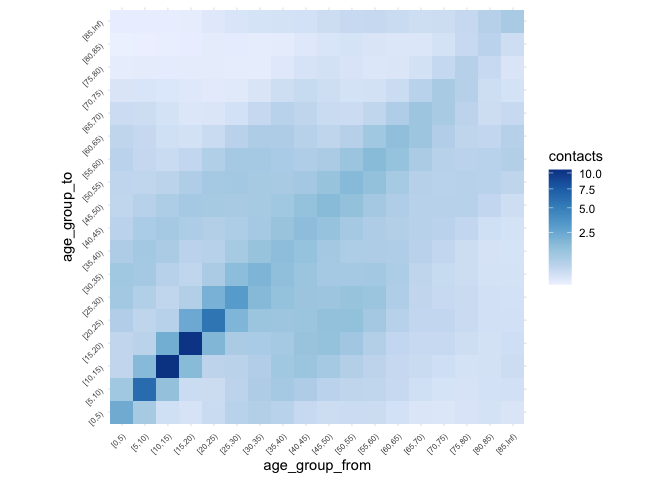
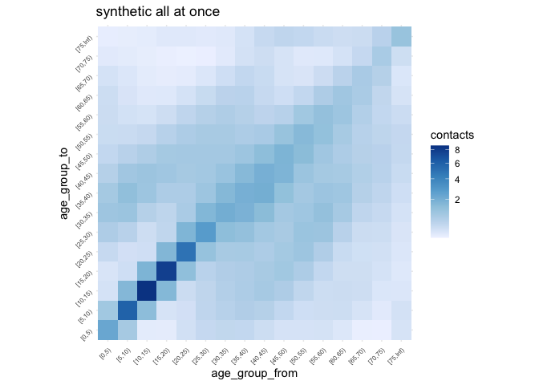

<!-- README.md is generated from README.Rmd. Please edit that file -->

# conmat

<!-- badges: start -->

[](https://codecov.io/gh/njtierney/conmat?branch=master)
[](https://github.com/njtierney/conmat/actions)
<!-- badges: end -->

The goal of conmat is to provide methods for producing contact matrices.

## Installation

You can install the development version with:

``` r
install.packages("conmat", repos = "https://njtierney.r-universe.dev")
```

Or alternatively you can use `remotes` (although I recommend using the
above code)

``` r
# install.packages("remotes")
remotes::install_github("njtierney/conmat")
```

## Disclaimer

The contact matrices created using the package are in transposed format
when compared to the contact matrices discussed by
[Prem](https://journals.plos.org/ploscompbiol/article?id=10.1371/journal.pcbi.1005697)
and
[Mossong](https://journals.plos.org/plosmedicine/article?id=10.1371/journal.pmed.0050074).

## Example

We can extract out the ABS age population data using `abs_age_lga` like
so:

``` r
library(conmat)
fairfield_age_pop <- abs_age_lga("Fairfield (C)")
fairfield_age_pop
#> # A tibble: 18 x 4
#>    lga           lower.age.limit  year population
#>    <chr>                   <dbl> <dbl>      <dbl>
#>  1 Fairfield (C)               0  2020      12261
#>  2 Fairfield (C)               5  2020      13093
#>  3 Fairfield (C)              10  2020      13602
#>  4 Fairfield (C)              15  2020      14323
#>  5 Fairfield (C)              20  2020      15932
#>  6 Fairfield (C)              25  2020      16190
#>  7 Fairfield (C)              30  2020      14134
#>  8 Fairfield (C)              35  2020      13034
#>  9 Fairfield (C)              40  2020      12217
#> 10 Fairfield (C)              45  2020      13449
#> 11 Fairfield (C)              50  2020      13419
#> 12 Fairfield (C)              55  2020      13652
#> 13 Fairfield (C)              60  2020      12907
#> 14 Fairfield (C)              65  2020      10541
#> 15 Fairfield (C)              70  2020       8227
#> 16 Fairfield (C)              75  2020       5598
#> 17 Fairfield (C)              80  2020       4006
#> 18 Fairfield (C)              85  2020       4240
```

Note that you need to use the exact LGA name - you can look up LGA names
in the data set `abs_lga_lookup`:

``` r
abs_lga_lookup
#> # A tibble: 545 x 3
#>    state lga_code lga                  
#>    <chr>    <dbl> <chr>                
#>  1 NSW      10050 Albury (C)           
#>  2 NSW      10180 Armidale Regional (A)
#>  3 NSW      10250 Ballina (A)          
#>  4 NSW      10300 Balranald (A)        
#>  5 NSW      10470 Bathurst Regional (A)
#>  6 NSW      10500 Bayside (A)          
#>  7 NSW      10550 Bega Valley (A)      
#>  8 NSW      10600 Bellingen (A)        
#>  9 NSW      10650 Berrigan (A)         
#> 10 NSW      10750 Blacktown (C)        
#> # ... with 535 more rows
```

First we want to fit the model to the polymod data

``` r
set.seed(2021-09-24)
polymod_contact_data <- get_polymod_setting_data()
polymod_survey_data <- get_polymod_population()

setting_models <- fit_setting_contacts(
  contact_data_list = polymod_contact_data,
  population = polymod_survey_data
  )
```

Then we take this model and extrapolate to the fairfield data:

``` r
set.seed(2021-09-24)
synthetic_settings_5y_fairfield <- predict_setting_contacts(
  population = fairfield_age_pop,
  contact_model = setting_models,
  age_breaks = c(seq(0, 85, by = 5), Inf)
  )
```

``` r
# this code is erroring for the moment - something to do with rendering a large plot I think.
plot_setting_matrices(
  synthetic_settings_5y_fairfield,
  title = "Setting-specific synthetic contact matrices (fairfield 2020 projected)"
)
```


``` r
set.seed(2021-09-24)
plot_matrix(synthetic_settings_5y_fairfield$home)
```


``` r
plot_matrix(synthetic_settings_5y_fairfield$work)
```



``` r
plot_matrix(synthetic_settings_5y_fairfield$school)
```



``` r
plot_matrix(synthetic_settings_5y_fairfield$other)
```



``` r
plot_matrix(synthetic_settings_5y_fairfield$all)
```



``` r
# build synthetic age-structured contact matrices with GAMs
# analysis of polymod data

# set age breaks
age_breaks_5y <- c(seq(0, 75, by = 5), Inf)
age_breaks_1y <- c(seq(0, 100, by = 1), Inf)

# fit a single overall contact model to polymod
m_all <- fit_single_contact_model(
  contact_data = get_polymod_contact_data("all"),
  population = get_polymod_population()
)

m_all
#> 
#> Family: poisson 
#> Link function: log 
#> 
#> Formula:
#> contacts ~ s(age_to) + s(age_from) + s(abs(age_from - age_to)) + 
#>     s(abs(age_from - age_to), age_from) + school_probability + 
#>     work_probability + offset(log_contactable_population)
#> 
#> Estimated degrees of freedom:
#>  8.70  8.99  8.71 26.91  total = 56.32 
#> 
#> fREML score: 21301.69
```

``` r
# predict contacts at 1y and 5y resolutions for inspection
synthetic_all_5y <- predict_contacts(
  model = m_all, 
  population = get_polymod_population(),
  age_breaks = age_breaks_5y
) %>%
  predictions_to_matrix()

synthetic_all_5y
#>              [0,5)    [5,10)   [10,15)   [15,20)   [20,25)   [25,30)   [30,35)
#> [0,5)    2.3012903 0.9166033 0.1555392 0.1511161 0.3076355 0.4372129 0.4763292
#> [5,10)   0.9948041 5.9330700 1.4064865 0.2471897 0.2971012 0.5055610 0.6160098
#> [10,15)  0.2687292 1.6647089 8.6922410 1.5917106 0.3726303 0.5144598 0.6758048
#> [15,20)  0.2416822 0.3330246 1.8497460 7.7866079 1.3813847 0.5895343 0.7259776
#> [20,25)  0.4198513 0.3000843 0.3250336 1.7084273 4.9145080 1.2549903 0.8874821
#> [25,30)  0.7746433 0.5970261 0.3448015 0.4933879 1.7216306 2.7898319 1.4163807
#> [30,35)  1.0624932 1.1363800 0.6539756 0.5198493 0.8187148 1.6578526 2.0307660
#> [35,40)  0.9529808 1.3696402 1.0890560 0.7956853 0.8052365 1.1049831 1.6277494
#> [40,45)  0.6560043 1.0143467 1.1124714 1.0309522 0.9272499 0.9843561 1.1773591
#> [45,50)  0.4572412 0.6088694 0.7585883 0.9269292 0.9556541 0.9524143 0.9623098
#> [50,55)  0.3811080 0.3887100 0.4411449 0.6182761 0.7938177 0.8705121 0.8679536
#> [55,60)  0.3725233 0.2918226 0.2610762 0.3424909 0.5096054 0.6682137 0.7585118
#> [60,65)  0.3520001 0.2448017 0.1817359 0.1898721 0.2690806 0.4037493 0.5624741
#> [65,70)  0.2736354 0.2085553 0.1524271 0.1318981 0.1460546 0.2056205 0.3314891
#> [70,75)  0.1647940 0.1521194 0.1301054 0.1129241 0.1006666 0.1076246 0.1634967
#> [75,Inf) 0.1237751 0.1287082 0.1440978 0.1791214 0.1819326 0.1654075 0.1830073
#>            [35,40)   [40,45)   [45,50)   [50,55)   [55,60)   [60,65)   [65,70)
#> [0,5)    0.4691643 0.3564667 0.2676705 0.2674418 0.2790976 0.2043511 0.1191036
#> [5,10)   0.7202087 0.6645089 0.4561945 0.3329555 0.3436745 0.3547069 0.2510861
#> [10,15)  0.7875516 0.9021891 0.7740083 0.4921718 0.3589279 0.3684450 0.3446919
#> [15,20)  0.7741375 0.8769436 1.0010050 0.7960455 0.4616076 0.3377249 0.3394841
#> [20,25)  0.8881258 0.7977064 0.9562566 1.0880984 0.7262949 0.3910688 0.3185699
#> [25,30)  1.2849426 0.9649064 0.8611329 1.1599383 1.1058002 0.5987706 0.3661489
#> [30,35)  1.8482746 1.4832795 0.9638831 1.0392175 1.2840089 0.9130048 0.5056382
#> [35,40)  1.9641073 2.0155964 1.3371427 0.9737947 1.1174253 1.0432424 0.6698592
#> [40,45)  1.5800660 1.9505234 1.7697984 1.1351960 0.9373212 0.9026970 0.7120602
#> [45,50)  1.0852966 1.4220015 1.7896292 1.4825562 1.0198515 0.7944411 0.6471021
#> [50,55)  0.7963309 0.8614815 1.2180217 1.5623825 1.3039541 0.8961185 0.6219640
#> [55,60)  0.6723012 0.5395498 0.6231829 1.0088119 1.2977517 1.0854452 0.6980412
#> [60,65)  0.5919591 0.4192513 0.3278810 0.4631503 0.7858985 1.0173335 0.8348271
#> [65,70)  0.4637814 0.3947560 0.2489891 0.2332312 0.3620610 0.5758964 0.8520437
#> [70,75)  0.2793038 0.3409933 0.2525877 0.1774435 0.1888841 0.2664133 0.4320034
#> [75,Inf) 0.2726289 0.4231224 0.5089337 0.4656850 0.3829099 0.3396820 0.3695991
#>            [70,75)  [75,Inf)
#> [0,5)    0.1101253 0.2708418
#> [5,10)   0.1646448 0.3062504
#> [10,15)  0.2201165 0.2126019
#> [15,20)  0.2700893 0.1372890
#> [20,25)  0.3067109 0.1269611
#> [25,30)  0.3495779 0.1692167
#> [30,35)  0.4190219 0.2419497
#> [35,40)  0.5124333 0.3168121
#> [40,45)  0.5902116 0.3784456
#> [45,50)  0.5935160 0.4325505
#> [50,55)  0.5313283 0.4429266
#> [55,60)  0.4709015 0.3605491
#> [60,65)  0.4834002 0.2475793
#> [65,70)  0.6517684 0.2068056
#> [70,75)  0.8423462 0.3100834
#> [75,Inf) 0.5964413 1.2194732
```

``` r
set.seed(2021-09-08)
# predict contacts at 1y and 5y resolutions for inspection
synthetic_all_5y <- predict_contacts(
  model = m_all, 
  population = get_polymod_population(),
  age_breaks = age_breaks_5y
) %>%
  predictions_to_matrix()

synthetic_all_5y
#>              [0,5)    [5,10)   [10,15)   [15,20)   [20,25)   [25,30)   [30,35)
#> [0,5)    2.3012903 0.9166033 0.1555392 0.1511161 0.3076355 0.4372129 0.4763292
#> [5,10)   0.9948041 5.9330700 1.4064865 0.2471897 0.2971012 0.5055610 0.6160098
#> [10,15)  0.2687292 1.6647089 8.6922410 1.5917106 0.3726303 0.5144598 0.6758048
#> [15,20)  0.2416822 0.3330246 1.8497460 7.7866079 1.3813847 0.5895343 0.7259776
#> [20,25)  0.4198513 0.3000843 0.3250336 1.7084273 4.9145080 1.2549903 0.8874821
#> [25,30)  0.7746433 0.5970261 0.3448015 0.4933879 1.7216306 2.7898319 1.4163807
#> [30,35)  1.0624932 1.1363800 0.6539756 0.5198493 0.8187148 1.6578526 2.0307660
#> [35,40)  0.9529808 1.3696402 1.0890560 0.7956853 0.8052365 1.1049831 1.6277494
#> [40,45)  0.6560043 1.0143467 1.1124714 1.0309522 0.9272499 0.9843561 1.1773591
#> [45,50)  0.4572412 0.6088694 0.7585883 0.9269292 0.9556541 0.9524143 0.9623098
#> [50,55)  0.3811080 0.3887100 0.4411449 0.6182761 0.7938177 0.8705121 0.8679536
#> [55,60)  0.3725233 0.2918226 0.2610762 0.3424909 0.5096054 0.6682137 0.7585118
#> [60,65)  0.3520001 0.2448017 0.1817359 0.1898721 0.2690806 0.4037493 0.5624741
#> [65,70)  0.2736354 0.2085553 0.1524271 0.1318981 0.1460546 0.2056205 0.3314891
#> [70,75)  0.1647940 0.1521194 0.1301054 0.1129241 0.1006666 0.1076246 0.1634967
#> [75,Inf) 0.1237751 0.1287082 0.1440978 0.1791214 0.1819326 0.1654075 0.1830073
#>            [35,40)   [40,45)   [45,50)   [50,55)   [55,60)   [60,65)   [65,70)
#> [0,5)    0.4691643 0.3564667 0.2676705 0.2674418 0.2790976 0.2043511 0.1191036
#> [5,10)   0.7202087 0.6645089 0.4561945 0.3329555 0.3436745 0.3547069 0.2510861
#> [10,15)  0.7875516 0.9021891 0.7740083 0.4921718 0.3589279 0.3684450 0.3446919
#> [15,20)  0.7741375 0.8769436 1.0010050 0.7960455 0.4616076 0.3377249 0.3394841
#> [20,25)  0.8881258 0.7977064 0.9562566 1.0880984 0.7262949 0.3910688 0.3185699
#> [25,30)  1.2849426 0.9649064 0.8611329 1.1599383 1.1058002 0.5987706 0.3661489
#> [30,35)  1.8482746 1.4832795 0.9638831 1.0392175 1.2840089 0.9130048 0.5056382
#> [35,40)  1.9641073 2.0155964 1.3371427 0.9737947 1.1174253 1.0432424 0.6698592
#> [40,45)  1.5800660 1.9505234 1.7697984 1.1351960 0.9373212 0.9026970 0.7120602
#> [45,50)  1.0852966 1.4220015 1.7896292 1.4825562 1.0198515 0.7944411 0.6471021
#> [50,55)  0.7963309 0.8614815 1.2180217 1.5623825 1.3039541 0.8961185 0.6219640
#> [55,60)  0.6723012 0.5395498 0.6231829 1.0088119 1.2977517 1.0854452 0.6980412
#> [60,65)  0.5919591 0.4192513 0.3278810 0.4631503 0.7858985 1.0173335 0.8348271
#> [65,70)  0.4637814 0.3947560 0.2489891 0.2332312 0.3620610 0.5758964 0.8520437
#> [70,75)  0.2793038 0.3409933 0.2525877 0.1774435 0.1888841 0.2664133 0.4320034
#> [75,Inf) 0.2726289 0.4231224 0.5089337 0.4656850 0.3829099 0.3396820 0.3695991
#>            [70,75)  [75,Inf)
#> [0,5)    0.1101253 0.2708418
#> [5,10)   0.1646448 0.3062504
#> [10,15)  0.2201165 0.2126019
#> [15,20)  0.2700893 0.1372890
#> [20,25)  0.3067109 0.1269611
#> [25,30)  0.3495779 0.1692167
#> [30,35)  0.4190219 0.2419497
#> [35,40)  0.5124333 0.3168121
#> [40,45)  0.5902116 0.3784456
#> [45,50)  0.5935160 0.4325505
#> [50,55)  0.5313283 0.4429266
#> [55,60)  0.4709015 0.3605491
#> [60,65)  0.4834002 0.2475793
#> [65,70)  0.6517684 0.2068056
#> [70,75)  0.8423462 0.3100834
#> [75,Inf) 0.5964413 1.2194732

library(ggplot2)
plot_matrix(synthetic_all_5y) +
  ggtitle("synthetic all at once")
```



## Speeding up computation with `future`

`conmat` now supports parallelisation, which is useful in a couple of
contexts with the model fitting, here is an example:

``` r
library(future)
plan(multisession, workers = 4)
```

We set the future plan, saying multisession, with 4 workers.

Then we run the code as normal:

``` r
polymod_setting_data <- get_polymod_setting_data()
polymod_population <- get_polymod_population()

contact_model <- fit_setting_contacts(
  contact_data_list = polymod_setting_data,
  population = polymod_population
)

contact_model_pred <- predict_setting_contacts(
  population = polymod_population,
  contact_model = contact_model,
  age_breaks = c(seq(0, 75, by = 5), Inf)
)
```

Notably this is about 3 times faster than without using that plan.

## Data sources

This package provides data for use in calculating contact matrices.

These data are still being cleaned and processed, but their current
forms are shown below:

### eyre\_transmission\_probabilities

``` r
eyre_transmission_probabilities
#> # A tibble: 40,804 x 6
#>    setting   case_age contact_age case_age_5y contact_age_5y probability
#>    <chr>        <int>       <int> <chr>       <chr>                <dbl>
#>  1 household        0           0 0-4         0-4                  0.195
#>  2 household        0           1 0-4         0-4                  0.195
#>  3 household        0           2 0-4         0-4                  0.195
#>  4 household        0           3 0-4         0-4                  0.195
#>  5 household        0           4 0-4         0-4                  0.195
#>  6 household        0           5 0-4         5-9                  0.196
#>  7 household        0           6 0-4         5-9                  0.198
#>  8 household        0           7 0-4         5-9                  0.198
#>  9 household        0           8 0-4         5-9                  0.199
#> 10 household        0           9 0-4         5-9                  0.201
#> # ... with 40,794 more rows

library(ggplot2)
library(stringr)
library(dplyr)
#> 
#> Attaching package: 'dplyr'
#> The following objects are masked from 'package:stats':
#> 
#>     filter, lag
#> The following objects are masked from 'package:base':
#> 
#>     intersect, setdiff, setequal, union
eyre_transmission_probabilities %>%
   group_by(
     setting,
     case_age_5y,
     contact_age_5y
   ) %>%
   summarise(
     across(
       probability,
       mean
     ),
     .groups = "drop"
   ) %>%
   rename(
     case_age = case_age_5y,
     contact_age = contact_age_5y
   ) %>%
   mutate(
     across(
       ends_with("age"),
       ~ factor(.x,
                levels = str_sort(
                  unique(.x),
                  numeric = TRUE
                )
       )
     )
   ) %>%
   ggplot(
     aes(
       x = case_age,
       y = contact_age,
       fill = probability
     )
   ) +
   facet_wrap(~setting) +
   geom_tile() +
   scale_fill_viridis_c() +
   coord_fixed() +
   theme_minimal() +
   theme(
     axis.text = element_text(angle = 45, hjust = 1)
   )
```


### abs\_education\_state

``` r
abs_education_state
#> # A tibble: 4,194 x 5
#>     year state aboriginal_and_torres_strait_islander_~   age n_full_and_part_ti~
#>    <dbl> <chr> <chr>                                   <dbl>               <dbl>
#>  1  2006 ACT   Aboriginal and Torres Strait Islander       4                   5
#>  2  2006 ACT   Non-Indigenous                              4                 109
#>  3  2006 NSW   Aboriginal and Torres Strait Islander       4                 104
#>  4  2006 NSW   Non-Indigenous                              4                1870
#>  5  2006 NT    Aboriginal and Torres Strait Islander       4                 102
#>  6  2006 NT    Non-Indigenous                              4                  63
#>  7  2006 QLD   Aboriginal and Torres Strait Islander       4                  37
#>  8  2006 QLD   Non-Indigenous                              4                 740
#>  9  2006 SA    Aboriginal and Torres Strait Islander       4                  42
#> 10  2006 SA    Non-Indigenous                              4                1023
#> # ... with 4,184 more rows
```

### abs\_education\_state\_2020

``` r
abs_education_state_2020
#> # A tibble: 808 x 6
#>     year state   age population population_interpolated  prop
#>    <dbl> <chr> <dbl>      <dbl>                   <dbl> <dbl>
#>  1  2020 ACT       0          0                   5569. 0    
#>  2  2020 ACT       1          0                   5702. 0    
#>  3  2020 ACT       2          0                   5781. 0    
#>  4  2020 ACT       3          0                   5814. 0    
#>  5  2020 ACT       4          0                   5809. 0    
#>  6  2020 ACT       5       4558                   5772. 0.790
#>  7  2020 ACT       6       6161                   5710. 1.08 
#>  8  2020 ACT       7       6163                   5623. 1.10 
#>  9  2020 ACT       8       5881                   5510. 1.07 
#> 10  2020 ACT       9       5921                   5370. 1.10 
#> # ... with 798 more rows
```

### abs\_employ\_age\_lga

``` r
abs_employ_age_lga
#> # A tibble: 5,600 x 8
#>     year state lga    age_group total_employed total_unemployed total_labour_fo~
#>    <dbl> <chr> <chr>  <fct>              <dbl>            <dbl>            <dbl>
#>  1  2016 NSW   Albur~ 15-19               1527              300             1830
#>  2  2016 NSW   Armid~ 15-19                838              217             1055
#>  3  2016 NSW   Balli~ 15-19               1064              185             1255
#>  4  2016 NSW   Balra~ 15-19                 41                9               46
#>  5  2016 NSW   Bathu~ 15-19               1103              241             1341
#>  6  2016 NSW   Bega ~ 15-19                801               97              897
#>  7  2016 NSW   Belli~ 15-19                241               42              281
#>  8  2016 NSW   Berri~ 15-19                168               16              181
#>  9  2016 NSW   Black~ 15-19               7534             2136             9670
#> 10  2016 NSW   Bland~ 15-19                124               14              140
#> # ... with 5,590 more rows, and 1 more variable: total <dbl>
```

### abs\_household\_lga

``` r
abs_household_lga
#> # A tibble: 4,968 x 5
#>     year state lga                   n_persons_usually_resident n_households
#>    <dbl> <chr> <chr>                 <chr>                             <dbl>
#>  1  2016 NSW   Albury (C)            total                             19495
#>  2  2016 NSW   Albury (C)            1                                  6020
#>  3  2016 NSW   Albury (C)            2                                  6738
#>  4  2016 NSW   Albury (C)            3                                  2740
#>  5  2016 NSW   Albury (C)            4                                  2541
#>  6  2016 NSW   Albury (C)            5                                  1041
#>  7  2016 NSW   Albury (C)            6                                   311
#>  8  2016 NSW   Albury (C)            7                                    56
#>  9  2016 NSW   Albury (C)            8+                                   42
#> 10  2016 NSW   Armidale Regional (A) total                             10276
#> # ... with 4,958 more rows
```

### abs\_pop\_age\_lga\_2016

``` r
abs_pop_age_lga_2016
#> # A tibble: 9,792 x 5
#>     year state lga                age_group population
#>    <dbl> <chr> <chr>              <fct>          <dbl>
#>  1  2016 ACT   Unincorporated ACT 0-4            28054
#>  2  2016 ACT   Unincorporated ACT 5-9            25767
#>  3  2016 ACT   Unincorporated ACT 10-14          22170
#>  4  2016 ACT   Unincorporated ACT 15-19          24906
#>  5  2016 ACT   Unincorporated ACT 20-24          32615
#>  6  2016 ACT   Unincorporated ACT 25-29          34243
#>  7  2016 ACT   Unincorporated ACT 30-34          34574
#>  8  2016 ACT   Unincorporated ACT 35-39          30340
#>  9  2016 ACT   Unincorporated ACT 40-44          28387
#> 10  2016 ACT   Unincorporated ACT 45-49          26431
#> # ... with 9,782 more rows
```

### abs\_pop\_age\_lga\_2020

``` r
abs_pop_age_lga_2020
#> # A tibble: 9,774 x 5
#>     year state lga                age_group population
#>    <dbl> <chr> <chr>              <fct>          <dbl>
#>  1  2020 ACT   Unincorporated ACT 0-4            27861
#>  2  2020 ACT   Unincorporated ACT 5-9            28871
#>  3  2020 ACT   Unincorporated ACT 10-14          26015
#>  4  2020 ACT   Unincorporated ACT 15-19          23867
#>  5  2020 ACT   Unincorporated ACT 20-24          32626
#>  6  2020 ACT   Unincorporated ACT 25-29          33992
#>  7  2020 ACT   Unincorporated ACT 30-34          35734
#>  8  2020 ACT   Unincorporated ACT 35-39          35354
#>  9  2020 ACT   Unincorporated ACT 40-44          30155
#> 10  2020 ACT   Unincorporated ACT 45-49          29103
#> # ... with 9,764 more rows
```

### abs\_state\_age

``` r
abs_state_age
#> # A tibble: 168 x 3
#>    state age_group population
#>    <chr> <fct>          <dbl>
#>  1 NSW   0-4           495060
#>  2 VIC   0-4           401992
#>  3 QLD   0-4           314592
#>  4 SA    0-4            98400
#>  5 WA    0-4           171531
#>  6 TAS   0-4            29258
#>  7 NT    0-4            17766
#>  8 ACT   0-4            27846
#>  9 NSW   5-9           512687
#> 10 VIC   5-9           416633
#> # ... with 158 more rows
```

## Code of Conduct

Please note that the conmat project is released with a [Contributor Code
of
Conduct](https://contributor-covenant.org/version/2/0/CODE_OF_CONDUCT.html).
By contributing to this project, you agree to abide by its terms.
