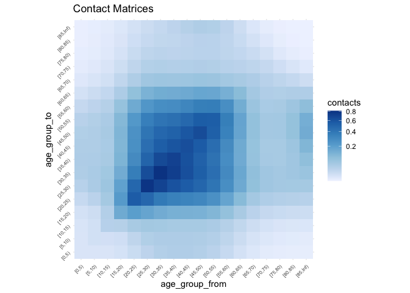

<!-- README.md is generated from README.Rmd. Please edit that file -->

# conmat

<!-- badges: start -->

[](https://codecov.io/gh/njtierney/conmat?branch=master)
[](https://github.com/njtierney/conmat/actions)
<!-- badges: end -->

The goal of conmat is to make it easy to generate synthetic contact
matrices for a given age population.

**What is a contact matrix?**

Contact matrices describe the degree of contact between individuals of
given age groups. These matrices are commonly used to model how diseases
such as COVID-19 spread in a population through social contact.

**Why do we need *synthetic* contact matrices?**

Contact matrices are produced from empirical data resulting from a
contact survey, which requires individuals to diary the amount and
manner of contact a person has in a day.

However, these surveys are highly time-consuming and expensive to run,
meaning that only a handful of these empirical datasets exist globally.

We can use statistical methods to create *synthetic contact matrices*,
which are new contact matrices that have been generalised to new
countries based on existing surveys.

**Why do we need `conmat`?**

Existing methods only provide outputs of the contact matrices for each
country, or at best, for urban and rural areas for a given country.

We need methods that allow for flexibly creating synthetic contact
matrices for a specified age population, as the age population
distribution of many countries (e.g., Australia), are quite
heterogeneous, and assuming it is homogeneous would result in inaccurate
representation of community infection in many regions.

## Installation

You can install the development version with:

``` r
install.packages("conmat", repos = "https://njtierney.r-universe.dev")
```

Or alternatively you can use `remotes`

``` r
# install.packages("remotes")
remotes::install_github("njtierney/conmat")
```

## Example

First we want to fit the model to the POLYMOD data, which contains
various survey and population data.

``` r
library(conmat)
polymod_contact_data <- get_polymod_setting_data()
polymod_survey_data <- get_polymod_population()
```

The contact data is a list of the contacts for each of the settings,
“home”, “work”, “school”, and “other”. It contains a dataframe for each
of these.

``` r
str(polymod_contact_data)
#> List of 4
#>  $ home  : tibble [8,787 × 5] (S3: tbl_df/tbl/data.frame)
#>   ..$ setting     : chr [1:8787] "home" "home" "home" "home" ...
#>   ..$ age_from    : int [1:8787] 0 0 0 0 0 0 0 0 0 0 ...
#>   ..$ age_to      : num [1:8787] 0 1 2 3 4 5 6 7 8 9 ...
#>   ..$ contacts    : int [1:8787] 10 7 12 14 11 7 8 9 6 6 ...
#>   ..$ participants: int [1:8787] 92 92 92 92 92 92 92 92 92 92 ...
#>  $ work  : tibble [8,787 × 5] (S3: tbl_df/tbl/data.frame)
#>   ..$ setting     : chr [1:8787] "work" "work" "work" "work" ...
#>   ..$ age_from    : int [1:8787] 0 0 0 0 0 0 0 0 0 0 ...
#>   ..$ age_to      : num [1:8787] 0 1 2 3 4 5 6 7 8 9 ...
#>   ..$ contacts    : int [1:8787] 0 0 0 0 0 0 0 0 0 0 ...
#>   ..$ participants: int [1:8787] 92 92 92 92 92 92 92 92 92 92 ...
#>  $ school: tibble [8,787 × 5] (S3: tbl_df/tbl/data.frame)
#>   ..$ setting     : chr [1:8787] "school" "school" "school" "school" ...
#>   ..$ age_from    : int [1:8787] 0 0 0 0 0 0 0 0 0 0 ...
#>   ..$ age_to      : num [1:8787] 0 1 2 3 4 5 6 7 8 9 ...
#>   ..$ contacts    : int [1:8787] 13 2 4 1 1 3 0 0 0 0 ...
#>   ..$ participants: int [1:8787] 92 92 92 92 92 92 92 92 92 92 ...
#>  $ other : tibble [8,787 × 5] (S3: tbl_df/tbl/data.frame)
#>   ..$ setting     : chr [1:8787] "other" "other" "other" "other" ...
#>   ..$ age_from    : int [1:8787] 0 0 0 0 0 0 0 0 0 0 ...
#>   ..$ age_to      : num [1:8787] 0 1 2 3 4 5 6 7 8 9 ...
#>   ..$ contacts    : int [1:8787] 7 5 13 11 4 6 3 5 2 3 ...
#>   ..$ participants: int [1:8787] 92 92 92 92 92 92 92 92 92 92 ...
```

Say looking at the “home” setting, each row contains survey information
of the number of contacts. Specifically, the number of contacts from one
age group to another age group, and then the nuber of participants in
that age group.

``` r
polymod_contact_data$home
#> # A tibble: 8,787 × 5
#>    setting age_from age_to contacts participants
#>    <chr>      <int>  <dbl>    <int>        <int>
#>  1 home           0      0       10           92
#>  2 home           0      1        7           92
#>  3 home           0      2       12           92
#>  4 home           0      3       14           92
#>  5 home           0      4       11           92
#>  6 home           0      5        7           92
#>  7 home           0      6        8           92
#>  8 home           0      7        9           92
#>  9 home           0      8        6           92
#> 10 home           0      9        6           92
#> # … with 8,777 more rows
#> # ℹ Use `print(n = ...)` to see more rows
```

The survey data contains the lower age limit and the population in that
age group.

``` r
polymod_survey_data
#> # A tibble: 21 × 2
#>    lower.age.limit population
#>              <int>      <dbl>
#>  1               0   1841420.
#>  2               5   1950666.
#>  3              10   2122856.
#>  4              15   2323822.
#>  5              20   2406141.
#>  6              25   2377541.
#>  7              30   2552587.
#>  8              35   2982293.
#>  9              40   3044427.
#> 10              45   2828202.
#> # … with 11 more rows
#> # ℹ Use `print(n = ...)` to see more rows
```

We can create a model for each of the settings with the function
`fit_setting_contacts`

``` r
set.seed(2021-09-24)
setting_models <- fit_setting_contacts(
  contact_data_list = polymod_contact_data,
  population = polymod_survey_data
  )
#> Warning in bgam.fit(G, mf, chunk.size, gp, scale, gamma, method = method, :
#> fitted rates numerically 0 occurred

#> Warning in bgam.fit(G, mf, chunk.size, gp, scale, gamma, method = method, :
#> fitted rates numerically 0 occurred
```

This contains a list of models, one for each setting. We can look at
one, and get summary information out:

``` r
names(setting_models)
#> [1] "home"   "work"   "school" "other"
setting_models$home
#> 
#> Family: poisson 
#> Link function: log 
#> 
#> Formula:
#> contacts ~ s(gam_age_offdiag) + s(gam_age_offdiag_2) + s(gam_age_diag_prod) + 
#>     s(gam_age_diag_sum) + s(gam_age_pmax) + s(gam_age_pmin) + 
#>     school_probability + work_probability + offset(log_contactable_population)
#> 
#> Estimated degrees of freedom:
#> 7.74 1.00 6.26 2.93 8.49 3.66  total = 33.1 
#> 
#> fREML score: 14725.69     rank: 55/57
```

So this gives us our baseline model of a contact model. We have fit this
model to the existing contact survey data.

We can now predict to another age population, to create our “synthetic”
contact matrix. Say we want to create a contact matrix for the
“Fairfield” LGA, we can extract it out like so:

``` r
library(conmat)
fairfield_age_pop <- abs_age_lga("Fairfield (C)")
fairfield_age_pop
#> # A tibble: 18 × 4
#>    lga           lower.age.limit  year population
#>    <chr>                   <dbl> <dbl>      <dbl>
#>  1 Fairfield (C)               0  2020      12261
#>  2 Fairfield (C)               5  2020      13093
#>  3 Fairfield (C)              10  2020      13602
#>  4 Fairfield (C)              15  2020      14323
#>  5 Fairfield (C)              20  2020      15932
#>  6 Fairfield (C)              25  2020      16190
#>  7 Fairfield (C)              30  2020      14134
#>  8 Fairfield (C)              35  2020      13034
#>  9 Fairfield (C)              40  2020      12217
#> 10 Fairfield (C)              45  2020      13449
#> 11 Fairfield (C)              50  2020      13419
#> 12 Fairfield (C)              55  2020      13652
#> 13 Fairfield (C)              60  2020      12907
#> 14 Fairfield (C)              65  2020      10541
#> 15 Fairfield (C)              70  2020       8227
#> 16 Fairfield (C)              75  2020       5598
#> 17 Fairfield (C)              80  2020       4006
#> 18 Fairfield (C)              85  2020       4240
```

Then we take the model we had earlier, and extrapolate to the fairfield
data with `predict_setting_contacts`, also providing some age breaks we
want to predict to

``` r
set.seed(2021-09-24)
synthetic_settings_5y_fairfield <- predict_setting_contacts(
  population = fairfield_age_pop,
  contact_model = setting_models,
  age_breaks = c(seq(0, 85, by = 5), Inf)
  )
```

This then returns a list of synthetic matrices, “home”, “work”,
“school”, “other”, and “all”, which is the sum of all matrices.

``` r
str(synthetic_settings_5y_fairfield)
#> List of 5
#>  $ home  : num [1:18, 1:18] 0.52 0.452 0.238 0.172 0.267 ...
#>   ..- attr(*, "dimnames")=List of 2
#>   .. ..$ : chr [1:18] "[0,5)" "[5,10)" "[10,15)" "[15,20)" ...
#>   .. ..$ : chr [1:18] "[0,5)" "[5,10)" "[10,15)" "[15,20)" ...
#>  $ work  : num [1:18, 1:18] 0.00209 0.00365 0.00306 0.00446 0.01122 ...
#>   ..- attr(*, "dimnames")=List of 2
#>   .. ..$ : chr [1:18] "[0,5)" "[5,10)" "[10,15)" "[15,20)" ...
#>   .. ..$ : chr [1:18] "[0,5)" "[5,10)" "[10,15)" "[15,20)" ...
#>  $ school: num [1:18, 1:18] 1.2031 0.3343 0.0563 0.0332 0.0503 ...
#>   ..- attr(*, "dimnames")=List of 2
#>   .. ..$ : chr [1:18] "[0,5)" "[5,10)" "[10,15)" "[15,20)" ...
#>   .. ..$ : chr [1:18] "[0,5)" "[5,10)" "[10,15)" "[15,20)" ...
#>  $ other : num [1:18, 1:18] 0.76 0.413 0.158 0.103 0.137 ...
#>   ..- attr(*, "dimnames")=List of 2
#>   .. ..$ : chr [1:18] "[0,5)" "[5,10)" "[10,15)" "[15,20)" ...
#>   .. ..$ : chr [1:18] "[0,5)" "[5,10)" "[10,15)" "[15,20)" ...
#>  $ all   : num [1:18, 1:18] 2.485 1.203 0.455 0.313 0.466 ...
#>   ..- attr(*, "dimnames")=List of 2
#>   .. ..$ : chr [1:18] "[0,5)" "[5,10)" "[10,15)" "[15,20)" ...
#>   .. ..$ : chr [1:18] "[0,5)" "[5,10)" "[10,15)" "[15,20)" ...
synthetic_settings_5y_fairfield$home
#>                [0,5)     [5,10)    [10,15)     [15,20)    [20,25)    [25,30)
#> [0,5)    0.520491427 0.42750952 0.21368317 0.144753712 0.20924469 0.39906326
#> [5,10)   0.452063299 0.73324822 0.48053978 0.178220326 0.12005438 0.20385919
#> [10,15)  0.237901989 0.50594540 0.83444114 0.437735351 0.15584332 0.11408155
#> [15,20)  0.171960066 0.20021733 0.46706977 0.751190585 0.37901964 0.14220782
#> [20,25)  0.267154111 0.14495459 0.17871782 0.407353305 0.65897693 0.36332941
#> [25,30)  0.514088259 0.24835493 0.13200294 0.154213190 0.36659714 0.60095007
#> [30,35)  0.649311612 0.50396790 0.23709769 0.119555916 0.14546560 0.32861548
#> [35,40)  0.448101547 0.61116382 0.46050444 0.205870994 0.10894814 0.12736489
#> [40,45)  0.229530255 0.39340513 0.52495031 0.376480197 0.17697692 0.09078292
#> [45,50)  0.157063335 0.20114850 0.33970593 0.431637610 0.32678748 0.15066599
#> [50,55)  0.169089875 0.13907262 0.17597498 0.280567994 0.37508765 0.28151934
#> [55,60)  0.198186706 0.14506469 0.11751722 0.138974179 0.23284947 0.31292308
#> [60,65)  0.172206301 0.15308936 0.10821794 0.080513697 0.09893254 0.16942217
#> [65,70)  0.105087196 0.11812081 0.09824420 0.062291403 0.04629974 0.05983892
#> [70,75)  0.056390921 0.06871458 0.07019669 0.052134279 0.03334368 0.02784463
#> [75,80)  0.030941705 0.03628936 0.03901501 0.035562617 0.02753219 0.02061974
#> [80,85)  0.016615400 0.01972827 0.01989422 0.019185174 0.01894061 0.01742694
#> [85,Inf) 0.007885542 0.01072748 0.01077787 0.009864044 0.01068828 0.01259887
#>             [30,35)     [35,40)     [40,45)    [45,50)    [50,55)    [55,60)
#> [0,5)    0.54706615 0.415609092 0.221900555 0.14709175 0.15266908 0.17771802
#> [5,10)   0.44899655 0.599404066 0.402172089 0.19919744 0.13277875 0.13755364
#> [10,15)  0.22240357 0.475521514 0.565020753 0.35419659 0.17689362 0.11732382
#> [15,20)  0.11966183 0.226830605 0.432372914 0.48020942 0.30093279 0.14804337
#> [20,25)  0.15647840 0.129013706 0.218445194 0.39073862 0.43238804 0.26658740
#> [25,30)  0.35667333 0.152178835 0.113062495 0.18177103 0.32744448 0.36148517
#> [30,35)  0.52182106 0.304799663 0.118569849 0.08515999 0.14175964 0.26096726
#> [35,40)  0.27688062 0.441191804 0.244034874 0.09368120 0.07130434 0.12268782
#> [40,45)  0.10333382 0.234121901 0.385935660 0.21973236 0.09045327 0.07031842
#> [45,50)  0.07661411 0.092778545 0.226829202 0.40340194 0.24494131 0.10085836
#> [50,55)  0.13228354 0.073247210 0.096852145 0.25406337 0.47074572 0.28029472
#> [55,60)  0.24519734 0.126897514 0.075810719 0.10533397 0.28222239 0.52180825
#> [60,65)  0.24291496 0.208327321 0.111820835 0.06788289 0.09689609 0.26982641
#> [65,70)  0.11356963 0.176508730 0.150485501 0.07889170 0.04951398 0.07693219
#> [70,75)  0.04114682 0.082811459 0.125509109 0.10487793 0.05806560 0.04008423
#> [75,80)  0.01967946 0.029593870 0.056886504 0.08616932 0.07818698 0.04754954
#> [80,85)  0.01444971 0.013458184 0.019398303 0.03885828 0.06478585 0.06214998
#> [85,Inf) 0.01242883 0.009845942 0.008857925 0.01349839 0.02916322 0.04947961
#>             [60,65)    [65,70)    [70,75)    [75,80)    [80,85)   [85,Inf)
#> [0,5)    0.16421319 0.11840370 0.08263510 0.06358907 0.04875615 0.03073454
#> [5,10)   0.15436806 0.14073281 0.10647747 0.07886259 0.06121545 0.04421260
#> [10,15)  0.11489100 0.12323957 0.11452486 0.08926840 0.06499400 0.04676873
#> [15,20)  0.09120668 0.08337608 0.09075627 0.08682201 0.06687784 0.04567178
#> [20,25)  0.12044965 0.06660417 0.06238445 0.07224145 0.07096103 0.05318759
#> [25,30)  0.20812545 0.08685507 0.05256453 0.05459053 0.06587728 0.06325907
#> [30,35)  0.27493282 0.15187665 0.07156571 0.04800261 0.05032585 0.05749614
#> [35,40)  0.21418873 0.21442384 0.13083899 0.06557396 0.04257910 0.04137555
#> [40,45)  0.11029689 0.17538469 0.19024452 0.12092861 0.05887947 0.03571155
#> [45,50)  0.06912033 0.09491466 0.16410656 0.18909385 0.12175553 0.05617765
#> [50,55)  0.10233678 0.06178880 0.09424119 0.17796688 0.21055487 0.12589169
#> [55,60)  0.28693697 0.09666442 0.06550462 0.10897518 0.20337736 0.21506236
#> [60,65)  0.49583546 0.26843785 0.10025612 0.07166435 0.11210205 0.18724585
#> [65,70)  0.22718898 0.43314219 0.24656277 0.09133628 0.06017564 0.08782287
#> [70,75)  0.06524009 0.18957786 0.34876300 0.18774950 0.06457605 0.03962422
#> [75,80)  0.03325247 0.05007495 0.13387389 0.23343746 0.11915295 0.03661537
#> [80,85)  0.03642956 0.02310562 0.03224841 0.08344964 0.14199088 0.06425968
#> [85,Inf) 0.04581167 0.02538797 0.01489776 0.01930664 0.04837957 0.07972752
synthetic_settings_5y_fairfield$all
#>               [0,5)     [5,10)     [10,15)    [15,20)    [20,25)    [25,30)
#> [0,5)    2.48524730 1.13914299  0.40907926 0.26333656 0.36462291 0.70195282
#> [5,10)   1.20278689 6.97298641  1.56332232 0.43200812 0.33751161 0.50175489
#> [10,15)  0.45544425 1.64326346 10.41773679 1.85951132 0.59254941 0.44070301
#> [15,20)  0.31283047 0.48532911  1.98010953 9.46255187 2.01887235 0.79811582
#> [20,25)  0.46553397 0.40751413  0.67952311 2.16963025 4.47986893 2.05179436
#> [25,30)  0.90428196 0.61127144  0.50993428 0.86549382 2.07023970 3.32841321
#> [30,35)  1.24848607 1.03402414  0.66245609 0.64209976 1.08974762 1.85719322
#> [35,40)  0.98166532 1.16088083  0.93355710 0.69023582 0.79961635 1.10669382
#> [40,45)  0.59701736 0.82061014  0.96763590 0.88270826 0.80172153 0.88078555
#> [45,50)  0.45989328 0.56089094  0.72415746 0.94671951 1.01244810 0.94118154
#> [50,55)  0.44343829 0.47541957  0.50767388 0.70331807 1.03128792 1.09669079
#> [55,60)  0.41882042 0.41771886  0.35391863 0.40056529 0.67033133 0.98721931
#> [60,65)  0.32921739 0.35141821  0.25074302 0.21885243 0.32329319 0.55145804
#> [65,70)  0.21295476 0.26179689  0.19158301 0.14871994 0.16652030 0.23211053
#> [70,75)  0.12210322 0.16469044  0.12989132 0.11075724 0.11488986 0.12441958
#> [75,80)  0.06094058 0.08650957  0.07112615 0.06901566 0.07853729 0.08025894
#> [80,85)  0.02845892 0.04384803  0.03688537 0.03872861 0.04972702 0.05483403
#> [85,Inf) 0.01621648 0.02564150  0.02257301 0.02556416 0.03540916 0.04199129
#>             [30,35)    [35,40)    [40,45)    [45,50)    [50,55)   [55,60)
#> [0,5)    1.05189011 0.91048343 0.57717220 0.43069573 0.40037474 0.3755647
#> [5,10)   0.92123579 1.13854367 0.83889727 0.55545053 0.45390398 0.3960906
#> [10,15)  0.62140039 0.96400046 1.04149737 0.75504749 0.51032408 0.3533362
#> [15,20)  0.64266858 0.76050834 1.01375622 1.05325305 0.75436782 0.4267054
#> [20,25)  1.17224940 0.94688597 0.98957659 1.21058055 1.18883296 0.7674567
#> [25,30)  2.01575672 1.32230618 1.09694429 1.13548878 1.27559741 1.1404245
#> [30,35)  2.53063562 1.67547831 1.15496648 1.00563978 0.99512211 1.0249923
#> [35,40)  1.52201226 2.02649902 1.39262271 1.02234771 0.86367890 0.7737257
#> [40,45)  1.00655521 1.33605398 1.71787811 1.23763594 0.88657352 0.6611150
#> [45,50)  0.90472296 1.01249694 1.27760780 1.64250404 1.17455621 0.7303604
#> [50,55)  0.92860188 0.88721202 0.94929178 1.21829797 1.66406397 1.0844277
#> [55,60)  0.96305331 0.80027399 0.71275209 0.76277031 1.09188542 1.5744289
#> [60,65)  0.75432267 0.72527979 0.54886238 0.47600696 0.56772032 0.8876744
#> [65,70)  0.36526398 0.50082617 0.45171342 0.33220707 0.31976790 0.4136638
#> [70,75)  0.15599928 0.24349239 0.32229231 0.29044737 0.23936889 0.2563278
#> [75,80)  0.07733283 0.09445709 0.14226866 0.19215387 0.19939694 0.1844439
#> [80,85)  0.05053076 0.04821691 0.05757371 0.09003595 0.14172619 0.1579991
#> [85,Inf) 0.04351045 0.04364527 0.04715858 0.06142311 0.09357428 0.1282604
#>            [60,65)   [65,70)    [70,75)    [75,80)    [80,85)   [85,Inf)
#> [0,5)    0.3139365 0.2399401 0.17892971 0.12524050 0.08350971 0.06320503
#> [5,10)   0.3543535 0.3119130 0.25519796 0.18799914 0.13605738 0.10567981
#> [10,15)  0.2662046 0.2403257 0.21191575 0.16274038 0.12050371 0.09795177
#> [15,20)  0.2479181 0.1990593 0.19280815 0.16849376 0.13500456 0.11836531
#> [20,25)  0.3936071 0.2395466 0.21495347 0.20607322 0.18630238 0.17620497
#> [25,30)  0.6774347 0.3369041 0.23487675 0.21248468 0.20728348 0.21083865
#> [30,35)  0.8537476 0.4884675 0.27132591 0.18863205 0.17598988 0.20128062
#> [35,40)  0.7456860 0.6084066 0.38470883 0.20929759 0.15254900 0.18341028
#> [40,45)  0.5413822 0.5264535 0.48852506 0.30243291 0.17475290 0.19012420
#> [45,50)  0.4846841 0.3996786 0.45447427 0.42167114 0.28211165 0.25563095
#> [50,55)  0.5995977 0.3990404 0.38849870 0.45386140 0.46061196 0.40394115
#> [55,60)  0.9439642 0.5197639 0.41888433 0.42271305 0.51703076 0.55748168
#> [60,65)  1.2840051 0.7840682 0.51005393 0.39199404 0.36617114 0.46222309
#> [65,70)  0.6635879 1.0724579 0.70981048 0.37016025 0.22723488 0.25981317
#> [70,75)  0.3319095 0.5457625 0.89393689 0.45816409 0.20299639 0.19698129
#> [75,80)  0.1818864 0.2029397 0.32669218 0.47656662 0.24085836 0.15516978
#> [80,85)  0.1189939 0.0872513 0.10137365 0.16868692 0.18524918 0.07979798
#> [85,Inf) 0.1130877 0.0751072 0.07406026 0.08181827 0.06007799 0.07984119
```

## Plotting

Looking at the matrices is nice, but let’s plot them. We can use
`plot_setting_matrix` to plot all at once

``` r
# this code is erroring for the moment - something to do with rendering a large plot I think.
plot_setting_matrices(
  synthetic_settings_5y_fairfield,
  title = "Setting-specific synthetic contact matrices (fairfield 2020 projected)"
)
```


You can also plot individual matrices with `plot_matrix`

``` r
plot_matrix(synthetic_settings_5y_fairfield$home)
```



``` r
plot_matrix(synthetic_settings_5y_fairfield$all)
```


## Note

The contact matrices created using this package are transposed when
compared to the contact matrices discussed by
[Prem](https://journals.plos.org/ploscompbiol/article?id=10.1371/journal.pcbi.1005697)
and
[Mossong](https://journals.plos.org/plosmedicine/article?id=10.1371/journal.pmed.0050074).
That is, the rows are “age group to”, and the columns are “age group
from”.

## Speeding up computation with `future`

`conmat` supports parallelisation, which is useful in a couple of
contexts with the model fitting, here is an example:

``` r
library(future)
plan(multisession, workers = 4)
```

We set the future plan, saying “multisession”, with 4 workers. Then we
run the same code as above (note that you must specify the plan,
otherwise it does not know how to parallelise. See the [future package
documentation](https://future.futureverse.org/reference/plan.html) for
more details):

``` r
polymod_setting_data <- get_polymod_setting_data()
polymod_population <- get_polymod_population()

contact_model <- fit_setting_contacts(
  contact_data_list = polymod_setting_data,
  population = polymod_population
)
#> Warning in bgam.fit(G, mf, chunk.size, gp, scale, gamma, method = method, :
#> fitted rates numerically 0 occurred

#> Warning in bgam.fit(G, mf, chunk.size, gp, scale, gamma, method = method, :
#> fitted rates numerically 0 occurred

contact_model_pred <- predict_setting_contacts(
  population = polymod_population,
  contact_model = contact_model,
  age_breaks = c(seq(0, 75, by = 5), Inf)
)
```

Notably this is about 3 times faster than without using that plan.

## Data sources

This package provides data and helper functions for the data, for use in
calculating contact matrices. The data sources are from the Australian
Bureau of Statistics (ABS), as we were using these a lot when we created
the package. In the future we might wrap these data sources and helpers
into another package, but for the time being they are here.

Below are a couple of examples of data provided, see the “data sources”
vignette and helpful at the website for full details.

You can extract the age population structure for the LGA Fairfield, or
Brisbane, like so:

``` r
abs_age_lga("Fairfield (C)")
#> # A tibble: 18 × 4
#>    lga           lower.age.limit  year population
#>    <chr>                   <dbl> <dbl>      <dbl>
#>  1 Fairfield (C)               0  2020      12261
#>  2 Fairfield (C)               5  2020      13093
#>  3 Fairfield (C)              10  2020      13602
#>  4 Fairfield (C)              15  2020      14323
#>  5 Fairfield (C)              20  2020      15932
#>  6 Fairfield (C)              25  2020      16190
#>  7 Fairfield (C)              30  2020      14134
#>  8 Fairfield (C)              35  2020      13034
#>  9 Fairfield (C)              40  2020      12217
#> 10 Fairfield (C)              45  2020      13449
#> 11 Fairfield (C)              50  2020      13419
#> 12 Fairfield (C)              55  2020      13652
#> 13 Fairfield (C)              60  2020      12907
#> 14 Fairfield (C)              65  2020      10541
#> 15 Fairfield (C)              70  2020       8227
#> 16 Fairfield (C)              75  2020       5598
#> 17 Fairfield (C)              80  2020       4006
#> 18 Fairfield (C)              85  2020       4240
abs_age_lga("Brisbane (C)")
#> # A tibble: 18 × 4
#>    lga          lower.age.limit  year population
#>    <chr>                  <dbl> <dbl>      <dbl>
#>  1 Brisbane (C)               0  2020      72894
#>  2 Brisbane (C)               5  2020      75933
#>  3 Brisbane (C)              10  2020      73990
#>  4 Brisbane (C)              15  2020      72010
#>  5 Brisbane (C)              20  2020     104564
#>  6 Brisbane (C)              25  2020     119000
#>  7 Brisbane (C)              30  2020     110798
#>  8 Brisbane (C)              35  2020     100493
#>  9 Brisbane (C)              40  2020      86630
#> 10 Brisbane (C)              45  2020      86791
#> 11 Brisbane (C)              50  2020      76063
#> 12 Brisbane (C)              55  2020      69273
#> 13 Brisbane (C)              60  2020      59666
#> 14 Brisbane (C)              65  2020      49134
#> 15 Brisbane (C)              70  2020      42252
#> 16 Brisbane (C)              75  2020      29927
#> 17 Brisbane (C)              80  2020      20898
#> 18 Brisbane (C)              85  2020      22683
```

Note that you need to use the exact LGA name - you can look up LGA names
in the data set `abs_lga_lookup`:

``` r
abs_lga_lookup
#> # A tibble: 544 × 3
#>    state lga_code lga                  
#>    <chr>    <dbl> <chr>                
#>  1 NSW      10050 Albury (C)           
#>  2 NSW      10180 Armidale Regional (A)
#>  3 NSW      10250 Ballina (A)          
#>  4 NSW      10300 Balranald (A)        
#>  5 NSW      10470 Bathurst Regional (A)
#>  6 NSW      10500 Bayside (A)          
#>  7 NSW      10550 Bega Valley (A)      
#>  8 NSW      10600 Bellingen (A)        
#>  9 NSW      10650 Berrigan (A)         
#> 10 NSW      10750 Blacktown (C)        
#> # … with 534 more rows
#> # ℹ Use `print(n = ...)` to see more rows
```

Or get the information for states like so:

``` r
abs_age_state(state_name = "QLD")
#> # A tibble: 18 × 4
#> # Groups:   year, state [1]
#>     year state lower.age.limit population
#>    <dbl> <chr>           <dbl>      <dbl>
#>  1  2020 QLD                 0     314602
#>  2  2020 QLD                 5     339247
#>  3  2020 QLD                10     345205
#>  4  2020 QLD                15     319014
#>  5  2020 QLD                20     338824
#>  6  2020 QLD                25     370468
#>  7  2020 QLD                30     362541
#>  8  2020 QLD                35     354219
#>  9  2020 QLD                40     325208
#> 10  2020 QLD                45     348003
#> 11  2020 QLD                50     321168
#> 12  2020 QLD                55     317489
#> 13  2020 QLD                60     288317
#> 14  2020 QLD                65     254114
#> 15  2020 QLD                70     226033
#> 16  2020 QLD                75     156776
#> 17  2020 QLD                80     100692
#> 18  2020 QLD                85      94266
abs_age_state(state_name = "NSW")
#> # A tibble: 18 × 4
#> # Groups:   year, state [1]
#>     year state lower.age.limit population
#>    <dbl> <chr>           <dbl>      <dbl>
#>  1  2020 NSW                 0     495091
#>  2  2020 NSW                 5     512778
#>  3  2020 NSW                10     500881
#>  4  2020 NSW                15     468550
#>  5  2020 NSW                20     540233
#>  6  2020 NSW                25     607891
#>  7  2020 NSW                30     611590
#>  8  2020 NSW                35     582824
#>  9  2020 NSW                40     512803
#> 10  2020 NSW                45     527098
#> 11  2020 NSW                50     484708
#> 12  2020 NSW                55     495116
#> 13  2020 NSW                60     461329
#> 14  2020 NSW                65     404034
#> 15  2020 NSW                70     355280
#> 16  2020 NSW                75     253241
#> 17  2020 NSW                80     174990
#> 18  2020 NSW                85     179095
```

## Code of Conduct

Please note that the conmat project is released with a [Contributor Code
of
Conduct](https://contributor-covenant.org/version/2/0/CODE_OF_CONDUCT.html).
By contributing to this project, you agree to abide by its terms.
