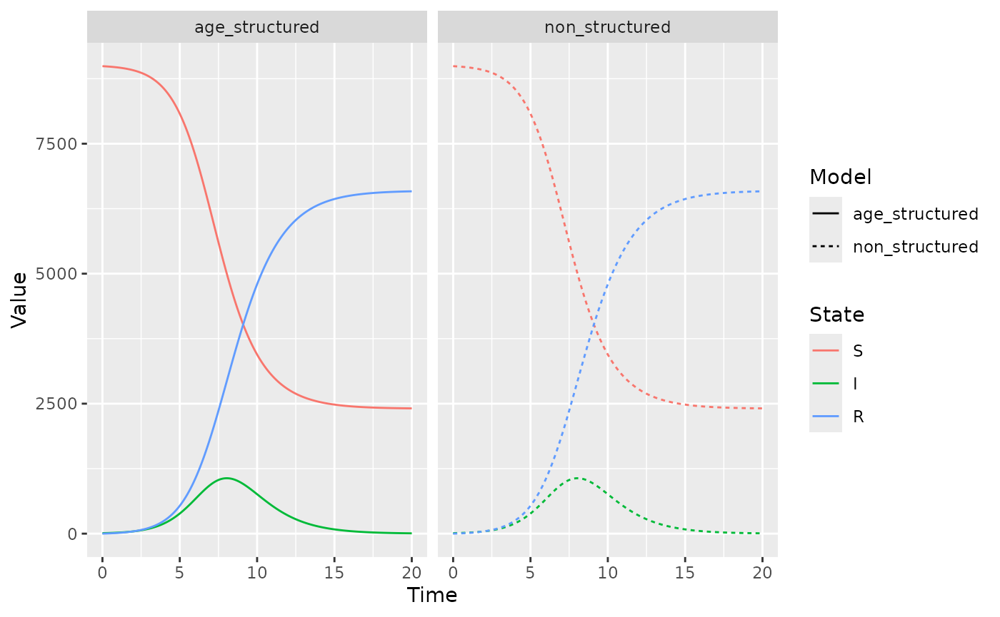

# SIR modelling with conmat

## Introduction: What is an SIR model?

SIR (Susceptible, Infected, Recovered) models, sometimes known as
[compartmental
models](https://en.wikipedia.org/wiki/Compartmental_models_in_epidemiology),
are a mathematical modelling technique used to understand facets of an
epidemic. They can help answer questions like:

- What is the duration of an epidemic?
- What is the total number of infected people?
- How does the disease spread?
- What is the reproductive number?
- What is the impact of a public health intervention?

The **SIR** refers to the number of:

- S: *s*usceptible
- I: *i*nfected
- R: *r*ecovered / *r*emoved

people at a given time point. We can model how these numbers change at
each time step, based on initial population numbers, and other
parameters like how infection spreads (is it more likely to infect
younger or older people?),

## An SIR Model with homogenous mixing

We start with a complicated version of a relatively simple model: an
age-stratified SIR Model, but with all age groups acting exactly the
same.

We will use 17 age groups, each in 5 year age bands, and turn these into
a `conmat_population` object. This is an object that knows which columns
represent age and population, which is used by other functions within
`conmat`.

``` r
homogeneous_population <- data.frame(
  age = seq(0, 80, by = 10),
  population = rep(100, times = 9)
) |>
  as_conmat_population(
    age = age,
    population = population
  )

homogeneous_population
#> # A tibble: 9 × 2 (conmat_population)
#>  - age: age
#>  - population: population
#>     age population
#>   <dbl>      <dbl>
#> 1     0        100
#> 2    10        100
#> 3    20        100
#> 4    30        100
#> 5    40        100
#> 6    50        100
#> 7    60        100
#> 8    70        100
#> 9    80        100
```

Then, we extrapolate these into a set of contact matrices, which we can
construct using `setting_prediction_matrix`. We set these as matrices of
1 - the contact rate is homogenous and exactly the same.

``` r
age_breaks_0_80_plus <- c(seq(0, 80, by = 10), Inf)
mat_ones <- matrix(1, nrow = 9, ncol = 9)

# Relative number of contacts between individuals in 2 age categories
# Think of as P(contact)
homogeneous_contact <- setting_prediction_matrix(
  home = mat_ones,
  work = mat_ones,
  school = mat_ones,
  other = mat_ones,
  age_breaks = age_breaks_0_80_plus
)

homogeneous_contact
#> 
#> ── Setting Prediction Matrices ─────────────────────────────────────────────────
#> A list of matrices containing the model predicted contact rate between ages in
#> each setting.
#> There are 9 age breaks, ranging 0-80+ years, with a regular 10 year interval
#> • home: a 9x9 <matrix>
#> • work: a 9x9 <matrix>
#> • school: a 9x9 <matrix>
#> • other: a 9x9 <matrix>
#> • all: a 9x9 <matrix>
#> ℹ Access each <matrix> with `x$name`
#> ℹ e.g., `x$home`
```

Similarly, we construct a set of transmission matrices, which provide
the probability of transmission for each age group, using
`transmission_probability_matrix`. These all have the same transmission
probability - 0.05 (1 in 20).

``` r
mat_05 <- matrix(0.05, nrow = 9, ncol = 9)
transmission_matrix <- transmission_probability_matrix(
  home = mat_05,
  work = mat_05,
  school = mat_05,
  other = mat_05,
  age_breaks = age_breaks_0_80_plus
)

transmission_matrix
#> 
#> ── Transmission Probability Matrices ───────────────────────────────────────────
#> A list of matrices, each <matrix> containing the relative probability of
#> individuals in a given age group infecting an individual in another age group,
#> for that setting.
#> There are 9 age breaks, ranging 0-80+ years, with a regular 10 year interval
#> • home: a 9x9 <matrix>
#> • work: a 9x9 <matrix>
#> • school: a 9x9 <matrix>
#> • other: a 9x9 <matrix>
#> ℹ Access each <matrix> with `x$name`
#> ℹ e.g., `x$home`
```

We also need to set up our population structures. We’ll have all the S
states, then I, then R. Since we’re using `deSolve` to solve this
system, we need to make sure this order stays the same throughout!

``` r
S0 <- rep(999, times = 9)
I0 <- rep(1, times = 9)
R0 <- rep(0, times = 9)
initial_condition <- c(S0, I0, R0)
names(initial_condition) <- paste(
  rep(c("S0", "I0", "R0"), each = 9),
  age_breaks_0_80_plus[1:9],
  sep = "_"
)

initial_condition
#>  S0_0 S0_10 S0_20 S0_30 S0_40 S0_50 S0_60 S0_70 S0_80  I0_0 I0_10 I0_20 I0_30 
#>   999   999   999   999   999   999   999   999   999     1     1     1     1 
#> I0_40 I0_50 I0_60 I0_70 I0_80  R0_0 R0_10 R0_20 R0_30 R0_40 R0_50 R0_60 R0_70 
#>     1     1     1     1     1     0     0     0     0     0     0     0     0 
#> R0_80 
#>     0
```

For an SIR model, we need to compute the *force of infection*, which is
$$\lambda(t) = \beta I(t).$$ The $\beta$ term is the product of the
probability of infection given contact, and the probability of contact,
for which we can use the matrices we have just defined:

``` r
parameters <- list(
  "transmission_matrix" = transmission_matrix,
  "homogeneous_contact" = homogeneous_contact,
  "gamma" = 1,
  "s_indexes" = 1:9,
  "i_indexes" = 10:18,
  "r_indexes" = 19:27
)

parameters
#> $transmission_matrix
#> 
#> ── Transmission Probability Matrices ───────────────────────────────────────────
#> A list of matrices, each <matrix> containing the relative probability of
#> individuals in a given age group infecting an individual in another age group,
#> for that setting.
#> There are 9 age breaks, ranging 0-80+ years, with a regular 10 year interval
#> • home: a 9x9 <matrix>
#> • work: a 9x9 <matrix>
#> • school: a 9x9 <matrix>
#> • other: a 9x9 <matrix>
#> ℹ Access each <matrix> with `x$name`
#> ℹ e.g., `x$home`
#> 
#> $homogeneous_contact
#> 
#> ── Setting Prediction Matrices ─────────────────────────────────────────────────
#> A list of matrices containing the model predicted contact rate between ages in
#> each setting.
#> There are 9 age breaks, ranging 0-80+ years, with a regular 10 year interval
#> • home: a 9x9 <matrix>
#> • work: a 9x9 <matrix>
#> • school: a 9x9 <matrix>
#> • other: a 9x9 <matrix>
#> • all: a 9x9 <matrix>
#> ℹ Access each <matrix> with `x$name`
#> ℹ e.g., `x$home`
#> 
#> $gamma
#> [1] 1
#> 
#> $s_indexes
#> [1] 1 2 3 4 5 6 7 8 9
#> 
#> $i_indexes
#> [1] 10 11 12 13 14 15 16 17 18
#> 
#> $r_indexes
#> [1] 19 20 21 22 23 24 25 26 27
```

Now we construct a function for the age structured SIR model, to pass to
deSolve. This calculates the force of infection for each setting.

``` r
age_structured_sir <- function(time, state, parameters) {
  # Calculate the force of infection for each setting:
  # unstructured SIR beta is age_group_n / pop_n

  N_by_age <- map_dbl(
    .x = parameters$s_indexes,
    .f = function(i) {
      current_indexes_to_sum <- c(
        parameters$s_indexes[i],
        parameters$i_indexes[i],
        parameters$r_indexes[i]
      )
      sum(state[current_indexes_to_sum])
    }
  )

  # normalise by the age population
  N_infected_by_age <- state[parameters$i_indexes] / N_by_age

  # functional method for takign the product of two matrices
  product <- function(transmission, contact) {
    map2(transmission, contact, `*`)
  }

  age_normalise <- function(beta) {
    # matrix multiply by infected and normalise by age population
    map(beta, function(beta) {
      beta %*% N_infected_by_age
    })
  }

  lambdas <- tibble(
    setting = names(parameters$transmission_matrix),
    transmission_matrix = parameters$transmission_matrix,
    homogeneous_contact = parameters$homogeneous_contact[1:4]
  ) %>%
    mutate(
      beta = product(transmission_matrix, homogeneous_contact),
      lambda = age_normalise(beta)
    )

  # Combine them all into one term for ease of computation
  lambda_total <- Reduce("+", lambdas$lambda)

  # Don't forget to normalise your infection rate by the population!
  dSdt <- -lambda_total * state[parameters$s_indexes]

  dIdt <- lambda_total * state[parameters$s_indexes] -
    parameters$gamma * state[parameters$i_indexes]

  dRdt <- parameters$gamma * state[parameters$i_indexes]

  return(
    list(
      c(
        dSdt,
        dIdt,
        dRdt
      )
    )
  )
}
```

Then we solve the ODE like so:

``` r
times <- seq(0, 20, by = 0.1)
homogeneous_soln <- ode(
  y = initial_condition,
  times = times,
  func = age_structured_sir,
  parms = parameters
)

# Have to convert ode output to a data frame to do any plotting
homogeneous_soln <- as.data.frame(homogeneous_soln) %>% as_tibble()
```

Now, let’s compare this to an SIR model with no stratification - as in,
no age groups:

``` r
parameters_sir <- c("beta" = 1.8, "gamma" = 1)
initial_condition_sir <- c("S" = 8991, "I" = 9, "R" = 0)

sir <- function(time, state, parameters) {
  N <- sum(state)
  lambda_total <- parameters["beta"] * state["I"]
  dSdt <- -lambda_total / N * state["S"]
  dIdt <- parameters["beta"] / N * state["S"] * state["I"] - parameters["gamma"] * state["I"]
  dRdt <- parameters["gamma"] * state["I"]

  return(list(c(dSdt, dIdt, dRdt)))
}

sir_soln <- ode(
  y = initial_condition_sir,
  times = times,
  func = sir,
  parms = parameters_sir
)

sir_soln <- as_tibble(as.data.frame(sir_soln))
```

``` r
ungrouped_structure <- sir_soln %>%
  pivot_longer(cols = -time)

# we are going to tidy up ODE output a few times, so wrap it into a function:
tidy_ode <- function(ode_soln) {
  ode_soln %>%
    pivot_longer(cols = -time) %>%
    mutate(parent_state = substr(name, 1, 1)) %>%
    group_by(time, parent_state) %>%
    summarise(value = sum(value)) %>%
    ungroup() %>%
    rename(name = parent_state)
}

# For the stratified model, we have to add up all the age categories together for a fair comparison.
grouped_structure <- tidy_ode(homogeneous_soln)
#> `summarise()` has regrouped the output.
#> ℹ Summaries were computed grouped by time and parent_state.
#> ℹ Output is grouped by time.
#> ℹ Use `summarise(.groups = "drop_last")` to silence this message.
#> ℹ Use `summarise(.by = c(time, parent_state))` for per-operation grouping
#>   (`?dplyr::dplyr_by`) instead.

combined_solutions <- bind_rows(
  "non_structured" = ungrouped_structure,
  "age_structured" = grouped_structure,
  .id = "type"
) %>%
  mutate(
    name = factor(name, levels = c("S", "I", "R"))
  )

combined_solutions
#> # A tibble: 1,206 × 4
#>    type            time name     value
#>    <chr>          <dbl> <fct>    <dbl>
#>  1 non_structured   0   S     8991    
#>  2 non_structured   0   I        9    
#>  3 non_structured   0   R        0    
#>  4 non_structured   0.1 S     8989.   
#>  5 non_structured   0.1 I        9.75 
#>  6 non_structured   0.1 R        0.937
#>  7 non_structured   0.2 S     8987.   
#>  8 non_structured   0.2 I       10.6  
#>  9 non_structured   0.2 R        1.95 
#> 10 non_structured   0.3 S     8986.   
#> # ℹ 1,196 more rows
```

Now let’s plot these two models approaches - the age structure and the
non age structured:

``` r
gg_combined_solutions <- ggplot(
  combined_solutions,
  aes(x = time, y = value, colour = name, linetype = type)
) +
  geom_line() +
  labs(x = "Time", y = "Value", colour = "State", linetype = "Model")

gg_combined_solutions
```


Voila! These lines are the same! We can double check this by plotting
them as facets:

``` r
gg_combined_solutions + facet_wrap(~type)
```



So, we have successfully collapsed our stratified model down to the
non-stratified model, which is a great sense check for every time you
write out a complicated model.

## Comparison to other age matrices

Now that we’ve established an age-structured SIR model, we can repeat
the process with `conmat` matrices. This process is the same as in the
vignette, “Data Sources”.

``` r
world_data <- socialmixr::wpp_age() %>%
  mutate(
    new_lower_age = if_else(lower.age.limit >= 75, 75L, lower.age.limit)
  ) %>%
  group_by(new_lower_age, country, year) %>%
  summarise(
    population = sum(population)
  )
#> `summarise()` has regrouped the output.
#> ℹ Summaries were computed grouped by new_lower_age, country, and year.
#> ℹ Output is grouped by new_lower_age and country.
#> ℹ Use `summarise(.groups = "drop_last")` to silence this message.
#> ℹ Use `summarise(.by = c(new_lower_age, country, year))` for per-operation
#>   grouping (`?dplyr::dplyr_by`) instead.
germany_2015 <- age_population(
  data = world_data,
  location_col = country,
  location = "Germany",
  age_col = new_lower_age,
  year_col = year,
  year = 2015
)

germany_2015
#> # A tibble: 16 × 6 (conmat_population)
#>  - age: lower.age.limit
#>  - population: population
#>    new_lower_age country  year population lower.age.limit upper.age.limit
#>            <int> <chr>   <int>      <dbl>           <dbl>           <dbl>
#>  1             0 Germany  2015    3517800               0               4
#>  2             5 Germany  2015    3507779               5               9
#>  3            10 Germany  2015    3693474              10              14
#>  4            15 Germany  2015    4101901              15              19
#>  5            20 Germany  2015    4571184              20              24
#>  6            25 Germany  2015    5213301              25              29
#>  7            30 Germany  2015    5058402              30              34
#>  8            35 Germany  2015    4782027              35              39
#>  9            40 Germany  2015    5190881              40              44
#> 10            45 Germany  2015    6805444              45              49
#> 11            50 Germany  2015    6920702              50              54
#> 12            55 Germany  2015    5998415              55              59
#> 13            60 Germany  2015    5091795              60              64
#> 14            65 Germany  2015    4216896              65              69
#> 15            70 Germany  2015    4225748              70              74
#> 16            75 Germany  2015    8812050              75              79
```

Now let’s construct a non-homogenous contact matrix, and transmission
probability matrix from the data we have on Germany.

``` r
age_breaks_socialmixr <- c(seq(0, 75, by = 5), Inf)

germany_contacts <- extrapolate_polymod(
  population = germany_2015,
  age_breaks = age_breaks_socialmixr
)

n_finite_states <- length(age_breaks_socialmixr) - 1
socialmixr_matrix <- matrix(0.1761765,
  nrow = n_finite_states,
  ncol = n_finite_states
)

transmission_matrix <- transmission_probability_matrix(
  home = socialmixr_matrix,
  work = socialmixr_matrix,
  school = socialmixr_matrix,
  other = socialmixr_matrix,
  age_breaks = age_breaks_socialmixr
)

parameters <- list(
  "transmission_matrix" = transmission_matrix,
  "homogeneous_contact" = germany_contacts,
  "gamma" = 1,
  "s_indexes" = 1:n_finite_states,
  "i_indexes" = (n_finite_states + 1):(2 * n_finite_states),
  "r_indexes" = (2 * n_finite_states + 1):(3 * n_finite_states)
)

S0 <- germany_2015$population
I0 <- rep(1, times = n_finite_states)
R0 <- rep(0, times = n_finite_states)
initial_condition <- c(S0, I0, R0)
names(initial_condition) <- paste(
  rep(c("S0", "I0", "R0"), each = n_finite_states),
  age_breaks_socialmixr[1:n_finite_states],
  sep = "_"
)
```

Then, similar to above, we solve the ODE

``` r
times <- seq(0, 100, by = 0.1)
germany_soln <- ode(
  y = initial_condition,
  times = times,
  func = age_structured_sir,
  parms = parameters
)

# Have to convert ode output to a data frame to do any plotting
germany_soln <- as_tibble(as.data.frame(germany_soln))

head(germany_soln)
#> # A tibble: 6 × 49
#>    time     S0_0    S0_5  S0_10  S0_15  S0_20  S0_25  S0_30  S0_35  S0_40  S0_45
#>   <dbl>    <dbl>   <dbl>  <dbl>  <dbl>  <dbl>  <dbl>  <dbl>  <dbl>  <dbl>  <dbl>
#> 1   0   3517800   3.51e6 3.69e6 4.10e6 4.57e6 5.21e6 5.06e6 4.78e6 5.19e6 6.81e6
#> 2   0.1 3517800.  3.51e6 3.69e6 4.10e6 4.57e6 5.21e6 5.06e6 4.78e6 5.19e6 6.81e6
#> 3   0.2 3517800.  3.51e6 3.69e6 4.10e6 4.57e6 5.21e6 5.06e6 4.78e6 5.19e6 6.81e6
#> 4   0.3 3517800.  3.51e6 3.69e6 4.10e6 4.57e6 5.21e6 5.06e6 4.78e6 5.19e6 6.81e6
#> 5   0.4 3517799.  3.51e6 3.69e6 4.10e6 4.57e6 5.21e6 5.06e6 4.78e6 5.19e6 6.81e6
#> 6   0.5 3517799.  3.51e6 3.69e6 4.10e6 4.57e6 5.21e6 5.06e6 4.78e6 5.19e6 6.81e6
#> # ℹ 38 more variables: S0_50 <dbl>, S0_55 <dbl>, S0_60 <dbl>, S0_65 <dbl>,
#> #   S0_70 <dbl>, S0_75 <dbl>, I0_0 <dbl>, I0_5 <dbl>, I0_10 <dbl>, I0_15 <dbl>,
#> #   I0_20 <dbl>, I0_25 <dbl>, I0_30 <dbl>, I0_35 <dbl>, I0_40 <dbl>,
#> #   I0_45 <dbl>, I0_50 <dbl>, I0_55 <dbl>, I0_60 <dbl>, I0_65 <dbl>,
#> #   I0_70 <dbl>, I0_75 <dbl>, R0_0 <dbl>, R0_5 <dbl>, R0_10 <dbl>, R0_15 <dbl>,
#> #   R0_20 <dbl>, R0_25 <dbl>, R0_30 <dbl>, R0_35 <dbl>, R0_40 <dbl>,
#> #   R0_45 <dbl>, R0_50 <dbl>, R0_55 <dbl>, R0_60 <dbl>, R0_65 <dbl>, …
tail(germany_soln)
#> # A tibble: 6 × 49
#>    time     S0_0    S0_5  S0_10  S0_15  S0_20  S0_25  S0_30  S0_35  S0_40  S0_45
#>   <dbl>    <dbl>   <dbl>  <dbl>  <dbl>  <dbl>  <dbl>  <dbl>  <dbl>  <dbl>  <dbl>
#> 1  99.5 1091740. 481484. 2.30e5 2.88e5 4.92e5 4.98e5 4.50e5 4.66e5 4.78e5 4.58e5
#> 2  99.6 1091740. 481484. 2.30e5 2.88e5 4.92e5 4.98e5 4.50e5 4.66e5 4.78e5 4.58e5
#> 3  99.7 1091740. 481484. 2.30e5 2.88e5 4.92e5 4.98e5 4.50e5 4.66e5 4.78e5 4.58e5
#> 4  99.8 1091740. 481484. 2.30e5 2.88e5 4.92e5 4.98e5 4.50e5 4.66e5 4.78e5 4.58e5
#> 5  99.9 1091740. 481484. 2.30e5 2.88e5 4.92e5 4.98e5 4.50e5 4.66e5 4.78e5 4.58e5
#> 6 100   1091740. 481484. 2.30e5 2.88e5 4.92e5 4.98e5 4.50e5 4.66e5 4.78e5 4.58e5
#> # ℹ 38 more variables: S0_50 <dbl>, S0_55 <dbl>, S0_60 <dbl>, S0_65 <dbl>,
#> #   S0_70 <dbl>, S0_75 <dbl>, I0_0 <dbl>, I0_5 <dbl>, I0_10 <dbl>, I0_15 <dbl>,
#> #   I0_20 <dbl>, I0_25 <dbl>, I0_30 <dbl>, I0_35 <dbl>, I0_40 <dbl>,
#> #   I0_45 <dbl>, I0_50 <dbl>, I0_55 <dbl>, I0_60 <dbl>, I0_65 <dbl>,
#> #   I0_70 <dbl>, I0_75 <dbl>, R0_0 <dbl>, R0_5 <dbl>, R0_10 <dbl>, R0_15 <dbl>,
#> #   R0_20 <dbl>, R0_25 <dbl>, R0_30 <dbl>, R0_35 <dbl>, R0_40 <dbl>,
#> #   R0_45 <dbl>, R0_50 <dbl>, R0_55 <dbl>, R0_60 <dbl>, R0_65 <dbl>, …

germany_soln_long <- germany_soln %>%
  tidy_ode() %>%
  mutate(type = "age_structured")
#> `summarise()` has regrouped the output.
#> ℹ Summaries were computed grouped by time and parent_state.
#> ℹ Output is grouped by time.
#> ℹ Use `summarise(.groups = "drop_last")` to silence this message.
#> ℹ Use `summarise(.by = c(time, parent_state))` for per-operation grouping
#>   (`?dplyr::dplyr_by`) instead.

germany_soln_long
#> # A tibble: 3,003 × 4
#>     time name        value type          
#>    <dbl> <chr>       <dbl> <chr>         
#>  1   0   I           16    age_structured
#>  2   0   R            0    age_structured
#>  3   0   S     81707799    age_structured
#>  4   0.1 I           18.5  age_structured
#>  5   0.1 R            1.72 age_structured
#>  6   0.1 S     81707795.   age_structured
#>  7   0.2 I           21.5  age_structured
#>  8   0.2 R            3.72 age_structured
#>  9   0.2 S     81707790.   age_structured
#> 10   0.3 I           24.9  age_structured
#> # ℹ 2,993 more rows
```

``` r
gg_germany_sir <- ggplot(
  germany_soln_long,
  aes(x = time, y = value / sum(initial_condition), colour = name)
) +
  geom_line() +
  labs(x = "Time", y = "Proportion")

gg_germany_sir
```


Let’s compare to the Prem matrices. Prem only has 16 age classes so we
do need to re-do our population.

``` r
# NOTE - consider ways to present this data nicer
# str(prem_germany_contact_matrices)
as_setting_prediction_matrix(
  prem_germany_contact_matrices,
  age_breaks = seq(0, 80, by = 5)
)
#> 
#> ── Setting Prediction Matrices ─────────────────────────────────────────────────
#> A list of matrices containing the model predicted contact rate between ages in
#> each setting.
#> There are 16 age breaks, ranging 0-80 years, with a regular 5 year interval
#> • home: a 16x16 <matrix>
#> • work: a 16x16 <matrix>
#> • school: a 16x16 <matrix>
#> • other: a 16x16 <matrix>
#> • all: a 16x16 <matrix>
#> ℹ Access each <matrix> with `x$name`
#> ℹ e.g., `x$home`
```

So we go through a similar process, setting up parameters, and solving
the ODE

``` r
parameters_prem <- list(
  "transmission_matrix" = transmission_matrix,
  "homogeneous_contact" = prem_germany_contact_matrices,
  "gamma" = 1,
  "s_indexes" = 1:n_finite_states,
  "i_indexes" = (n_finite_states + 1):(2 * n_finite_states),
  "r_indexes" = (2 * n_finite_states + 1):(3 * n_finite_states)
)

prem_soln <- ode(
  y = initial_condition,
  times = times,
  func = age_structured_sir,
  parms = parameters_prem
)

# Have to convert ode output to a data frame to do any plotting
prem_soln <- as_tibble(as.data.frame(prem_soln))

tail(prem_soln)
#> # A tibble: 6 × 49
#>    time     S0_0    S0_5  S0_10  S0_15  S0_20  S0_25  S0_30  S0_35  S0_40  S0_45
#>   <dbl>    <dbl>   <dbl>  <dbl>  <dbl>  <dbl>  <dbl>  <dbl>  <dbl>  <dbl>  <dbl>
#> 1  99.5 2757450.  2.53e6 1.86e6 1.01e6 1.79e6 2.64e6 2.48e6 1.84e6 1.87e6 3.01e6
#> 2  99.6 2757450.  2.53e6 1.86e6 1.01e6 1.79e6 2.64e6 2.48e6 1.84e6 1.87e6 3.01e6
#> 3  99.7 2757450.  2.53e6 1.86e6 1.01e6 1.79e6 2.64e6 2.48e6 1.84e6 1.87e6 3.01e6
#> 4  99.8 2757450.  2.53e6 1.86e6 1.01e6 1.79e6 2.64e6 2.48e6 1.84e6 1.87e6 3.01e6
#> 5  99.9 2757450.  2.53e6 1.86e6 1.01e6 1.79e6 2.64e6 2.48e6 1.84e6 1.87e6 3.01e6
#> 6 100   2757450.  2.53e6 1.86e6 1.01e6 1.79e6 2.64e6 2.48e6 1.84e6 1.87e6 3.01e6
#> # ℹ 38 more variables: S0_50 <dbl>, S0_55 <dbl>, S0_60 <dbl>, S0_65 <dbl>,
#> #   S0_70 <dbl>, S0_75 <dbl>, I0_0 <dbl>, I0_5 <dbl>, I0_10 <dbl>, I0_15 <dbl>,
#> #   I0_20 <dbl>, I0_25 <dbl>, I0_30 <dbl>, I0_35 <dbl>, I0_40 <dbl>,
#> #   I0_45 <dbl>, I0_50 <dbl>, I0_55 <dbl>, I0_60 <dbl>, I0_65 <dbl>,
#> #   I0_70 <dbl>, I0_75 <dbl>, R0_0 <dbl>, R0_5 <dbl>, R0_10 <dbl>, R0_15 <dbl>,
#> #   R0_20 <dbl>, R0_25 <dbl>, R0_30 <dbl>, R0_35 <dbl>, R0_40 <dbl>,
#> #   R0_45 <dbl>, R0_50 <dbl>, R0_55 <dbl>, R0_60 <dbl>, R0_65 <dbl>, …
```

``` r
germany_aggregated <- tidy_ode(germany_soln)
#> `summarise()` has regrouped the output.
#> ℹ Summaries were computed grouped by time and parent_state.
#> ℹ Output is grouped by time.
#> ℹ Use `summarise(.groups = "drop_last")` to silence this message.
#> ℹ Use `summarise(.by = c(time, parent_state))` for per-operation grouping
#>   (`?dplyr::dplyr_by`) instead.

# For the stratified model, we have to add up all the age categories together for a fair comparison.
prem_aggregated <- tidy_ode(prem_soln)
#> `summarise()` has regrouped the output.
#> ℹ Summaries were computed grouped by time and parent_state.
#> ℹ Output is grouped by time.
#> ℹ Use `summarise(.groups = "drop_last")` to silence this message.
#> ℹ Use `summarise(.by = c(time, parent_state))` for per-operation grouping
#>   (`?dplyr::dplyr_by`) instead.

conmat_prem_soln <- bind_rows(
  conmat = germany_aggregated,
  prem = prem_aggregated,
  .id = "type"
) %>%
  mutate(name = factor(name, levels = c("S", "I", "R")))

head(conmat_prem_soln)
#> # A tibble: 6 × 4
#>   type    time name        value
#>   <chr>  <dbl> <fct>       <dbl>
#> 1 conmat   0   I           16   
#> 2 conmat   0   R            0   
#> 3 conmat   0   S     81707799   
#> 4 conmat   0.1 I           18.5 
#> 5 conmat   0.1 R            1.72
#> 6 conmat   0.1 S     81707795.
tail(conmat_prem_soln)
#> # A tibble: 6 × 4
#>   type   time name    value
#>   <chr> <dbl> <fct>   <dbl>
#> 1 prem   99.9 I     2.82e-4
#> 2 prem   99.9 R     3.15e+7
#> 3 prem   99.9 S     5.02e+7
#> 4 prem  100   I     2.73e-4
#> 5 prem  100   R     3.15e+7
#> 6 prem  100   S     5.02e+7
```

``` r
ggplot(conmat_prem_soln, aes(x = time, y = value, colour = type)) +
  geom_line() +
  labs(x = "Time", y = "Value", colour = "Model") +
  facet_wrap(~name, nrow = 1)
```


These are really different, but we have to be careful about why. The
contact matrices might refer to the same quantity, but if we dive a
little deeper, we find out that might not be the case…

### Calculating reproductive number - R0

To fairly compare a dynamic disease model that differs *only* by it’s
contact matrices, it’s important to remember that the $(i,j)$th element
of one of these matrices is the *relative* number of contacts between
individuals of age $i$ and age $j$. But, what the number is relative to
might be different, and this will lead to different basic reproduction
numbers, which will give misleading model conclusions.

At this point, it is important to point out the two definitions of a
next generation matrix.

1.  The next generation of the offspring distribution assuming infinite
    lifetime, which probabilists will be used to, and
2.  The number of newly infected individuals over the course of one
    generation of infections, which infectious diseases modellers will
    be used to.

`conmat` calculates the first of these in it’s functions (such as
`generate_ngm`), hence why the arguments to these functions have no
concept of an infectious period (which is analogous to ‘death’ in a
branching process).

Following the approach of Diekmann, Heesterbrook and Roberts (2009), one
can think of the NGM generated by `conmat` as only the transmissions
term of Equation 2.9. So, to ensure both models have the same value of
$R_{0}$, we can multiply each matrix by a scaling factor to give a
target $R_{0}$.

To target $R_{0} = 1.5$ for example,

``` r
calculate_R0 <- function(multiplier, transmission_matrices, contact_matrices) {
  total_matrix <- transmission_matrices$home * contact_matrices$home +
    transmission_matrices$work * contact_matrices$work +
    transmission_matrices$school * contact_matrices$school +
    transmission_matrices$other * contact_matrices$other

  abs(Re(eigen(total_matrix * multiplier)$values[1]) - 1.5)
}

scaling_factor <- function(contact_matrix) {
  optimize(
    f = calculate_R0,
    interval = c(0.001, 5),
    transmission_matrices = transmission_matrix,
    contact_matrices = contact_matrix
  )
}

scaling_factor_prem <- scaling_factor(prem_germany_contact_matrices)
scaling_factor_socialmixr <- scaling_factor(germany_contacts)

scaling_factor_prem$minimum
#> [1] 0.9999758
scaling_factor_socialmixr$minimum
#> [1] 0.5805693
```

We can adjust our contact matrices with these factors, and then our R0s
will be the same, meaning that the only difference between the two
models should be differences in the contact matrices.

``` r
prem_germany_contact_matrices <- lapply(prem_germany_contact_matrices, `*`, scaling_factor_prem$minimum)
germany_contacts <- lapply(germany_contacts, `*`, scaling_factor_socialmixr$minimum)

parameters$homogeneous_contact <- germany_contacts
germany_soln <- ode(
  y = initial_condition,
  times = times,
  func = age_structured_sir,
  parms = parameters
)

parameters$homogeneous_contact <- prem_germany_contact_matrices
prem_soln <- ode(
  y = initial_condition,
  times = times,
  func = age_structured_sir,
  parms = parameters
)

germany_aggregated <- tidy_ode(as_tibble(as.data.frame(germany_soln)))
#> `summarise()` has regrouped the output.
#> ℹ Summaries were computed grouped by time and parent_state.
#> ℹ Output is grouped by time.
#> ℹ Use `summarise(.groups = "drop_last")` to silence this message.
#> ℹ Use `summarise(.by = c(time, parent_state))` for per-operation grouping
#>   (`?dplyr::dplyr_by`) instead.
prem_aggregated <- tidy_ode(as_tibble(as.data.frame(prem_soln)))
#> `summarise()` has regrouped the output.
#> ℹ Summaries were computed grouped by time and parent_state.
#> ℹ Output is grouped by time.
#> ℹ Use `summarise(.groups = "drop_last")` to silence this message.
#> ℹ Use `summarise(.by = c(time, parent_state))` for per-operation grouping
#>   (`?dplyr::dplyr_by`) instead.

conmat_prem_soln <- bind_rows(
  conmat = germany_aggregated,
  prem = prem_aggregated,
  .id = "type"
) %>%
  mutate(name = factor(name, levels = c("S", "I", "R")))
```

``` r
library(scales)
#> 
#> Attaching package: 'scales'
#> The following object is masked from 'package:purrr':
#> 
#>     discard
conmat_prem_soln %>%
  filter(time <= 50) %>%
  ggplot(aes(x = time, y = value, colour = type)) +
  geom_line() +
  facet_wrap(~name,
    ncol = 1,
    scales = "free_y",
    labeller = labeller(
      name = c(
        S = "Susceptible",
        I = "Infected",
        R = "Recovered"
      )
    )
  ) +
  scale_y_continuous(
    labels = label_number(scale_cut = cut_si("")),
    n.breaks = 3
  ) +
  scale_colour_brewer(palette = "Dark2") +
  labs(x = "Time", y = "Population", colour = "Model") +
  theme_minimal()
```


So now we have as fair of a comparison of the two matrices as we will
get, and yet, there are significant differences in the dynamics of the
two models.
