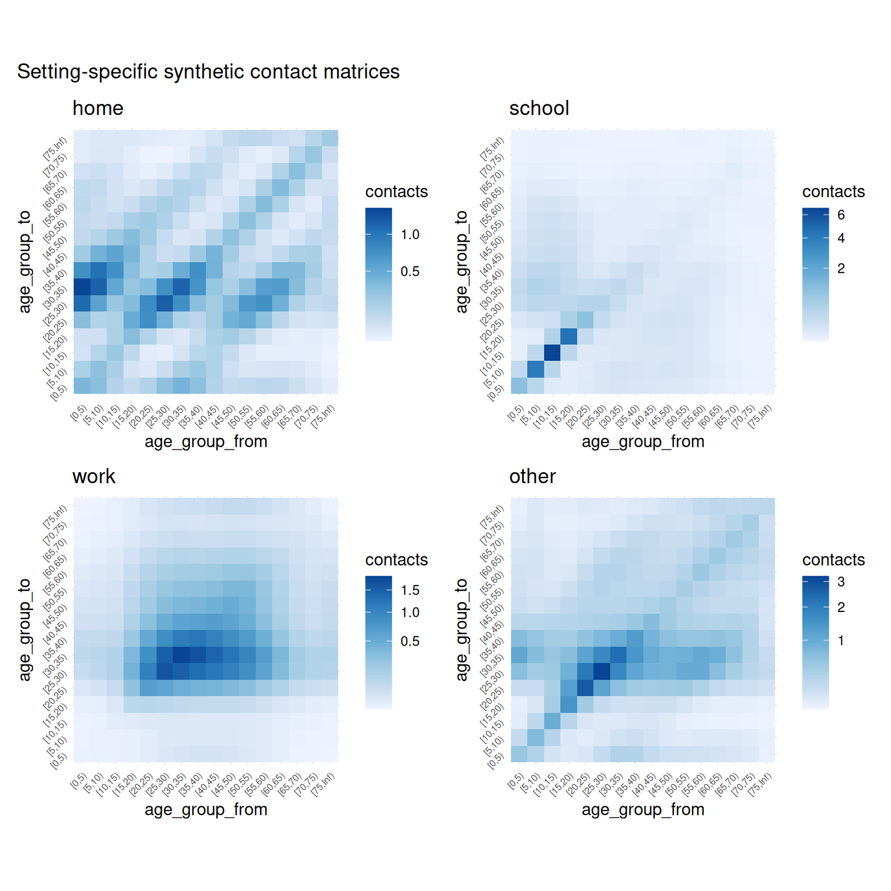
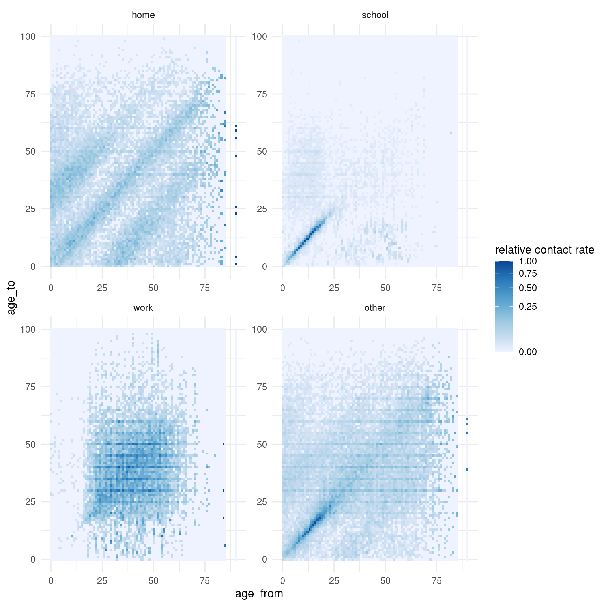

# Visualisation gallery

``` r
library(conmat)
```

This vignette will contain various visualisations that you can perform
with `conmat`. For the most part we have tried to make `autoplot` work
for most of the matrix type objects. As time goes on we will include
other visualisations here.

## extrapolate polymod

``` r
perth <- abs_age_lga("Perth (C)")

perth_contact <- extrapolate_polymod(
  perth
)

autoplot(perth_contact)
```



### For interest’s sake: visualising the empirical contact rate data

``` r
library(dplyr)
#> 
#> Attaching package: 'dplyr'
#> The following objects are masked from 'package:stats':
#> 
#>     filter, lag
#> The following objects are masked from 'package:base':
#> 
#>     intersect, setdiff, setequal, union
library(ggplot2)
# visualise empirical contact rate estimates
bind_rows(
  home = get_polymod_contact_data("home"),
  school = get_polymod_contact_data("school"),
  work = get_polymod_contact_data("work"),
  other = get_polymod_contact_data("other"),
  .id = "setting"
) %>%
  mutate(
    rate = contacts / participants,
    setting = factor(
      setting,
      levels = c(
        "home", "school", "work", "other"
      )
    )
  ) %>%
  group_by(
    setting
  ) %>%
  mutate(
    `relative contact rate` = rate / max(rate)
  ) %>%
  ungroup() %>%
  ggplot(
    aes(
      x = age_from,
      y = age_to,
      fill = `relative contact rate`
    )
  ) +
  facet_wrap(
    ~setting,
    ncol = 2,
    scales = "free"
  ) +
  geom_tile() +
  scale_fill_distiller(
    direction = 1,
    trans = "sqrt"
  ) +
  theme_minimal()
```


