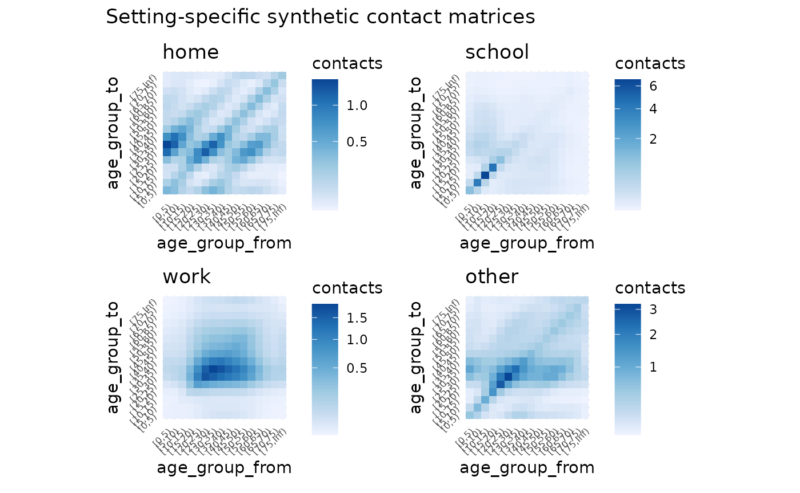
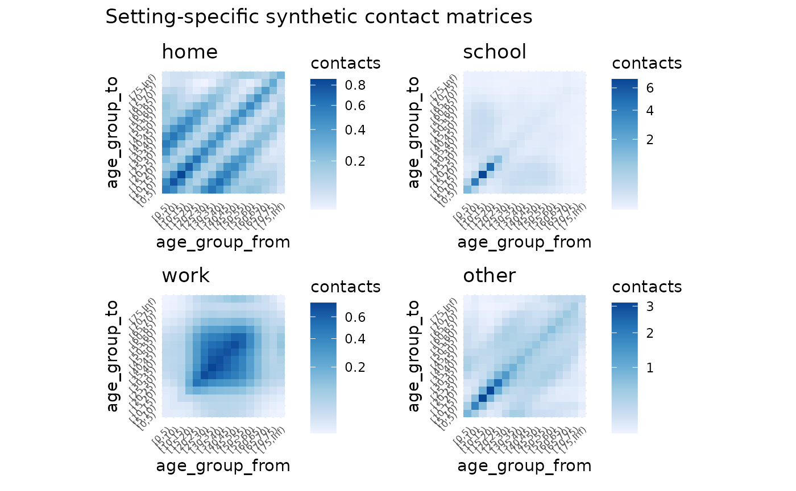

# Getting Started

``` r
library(conmat)
library(socialmixr)
library(ggplot2)
library(dplyr)
#> 
#> Attaching package: 'dplyr'
#> The following objects are masked from 'package:stats':
#> 
#>     filter, lag
#> The following objects are masked from 'package:base':
#> 
#>     intersect, setdiff, setequal, union
library(tidyr)
library(mgcv)
#> Loading required package: nlme
#> 
#> Attaching package: 'nlme'
#> The following object is masked from 'package:dplyr':
#> 
#>     collapse
#> This is mgcv 1.9-3. For overview type 'help("mgcv-package")'.
library(patchwork)
```

The goal of conmat is to simplify the process of generating synthetic
contact matrices for a given age population.

**What is a contact matrix?**

Contact matrices describe the degree of contact between individuals of
given age groups. For example, this matrix describes the number of
contacts between individuals.

    #>       0-4 5-9 10-14
    #> 0-4    10   3     4
    #> 5-9     3  11     5
    #> 10-14   4   5    13

The rows and columns represent the age groups of the people. On the main
diagonal we see that we have a higher number of contacts - showing that
people of similar ages tend to interact more with one another. We can
use the information in these matrices to model how diseases such as
COVID-19 spread in a population through social contact.

**Why do we need *synthetic* contact matrices?**

Contact matrices are produced from empirical data resulting from a
contact survey, which requires individuals to diary the amount and
manner of contact a person has in a day. However, these surveys are
highly time-consuming and expensive to run, meaning that only a handful
of these empirical datasets exist globally.

We can use statistical methods to create *synthetic contact matrices*,
which are new contact matrices that have been generalised to new
countries based on existing surveys.

**Why do we need `conmat`?**

Existing methods only provide outputs of the contact matrices for each
country, or at best, for urban and rural areas for a given country. We
need methods that allow for flexibly creating synthetic contact matrices
for a specified age population. This is because the age population
distribution of many countries (e.g., Australia), are quite
heterogeneous, and assuming it is homogeneous would result in inaccurate
representation of community infection in many regions.

### Quick example using Australian data

Suppose we want to get a contact matrix for a given region in Australia,
let’s say the city of Perth. We can get that from a helper function,
`abs_age_lga`.

``` r
perth <- abs_age_lga("Perth (C)")
perth
#> # A tibble: 18 × 4 (conmat_population)
#>  - age: lower.age.limit
#>  - population: population
#>    lga       lower.age.limit  year population
#>    <chr>               <dbl> <dbl>      <dbl>
#>  1 Perth (C)               0  2020       1331
#>  2 Perth (C)               5  2020        834
#>  3 Perth (C)              10  2020        529
#>  4 Perth (C)              15  2020        794
#>  5 Perth (C)              20  2020       3615
#>  6 Perth (C)              25  2020       5324
#>  7 Perth (C)              30  2020       4667
#>  8 Perth (C)              35  2020       3110
#>  9 Perth (C)              40  2020       1650
#> 10 Perth (C)              45  2020       1445
#> 11 Perth (C)              50  2020       1299
#> 12 Perth (C)              55  2020       1344
#> 13 Perth (C)              60  2020       1359
#> 14 Perth (C)              65  2020       1145
#> 15 Perth (C)              70  2020       1004
#> 16 Perth (C)              75  2020        673
#> 17 Perth (C)              80  2020        481
#> 18 Perth (C)              85  2020        367
```

(You can learn more about the data sources we provide in
`data-sources.Rmd`)

We can get a contact matrix made for `perth` using the
`extrapolate_polymod` function:

``` r
perth_contact <- extrapolate_polymod(
  population = perth
)

perth_contact
#> 
#> ── Setting Prediction Matrices ─────────────────────────────────────────────────
#> A list of matrices containing the model predicted contact rate between ages in
#> each setting.
#> There are 16 age breaks, ranging 0-75+ years, with a regular 5 year interval
#> • home: a 16x16 <matrix>
#> • work: a 16x16 <matrix>
#> • school: a 16x16 <matrix>
#> • other: a 16x16 <matrix>
#> • all: a 16x16 <matrix>
#> ℹ Access each <matrix> with `x$name`
#> ℹ e.g., `x$home`
```

We can plot this with `autoplot`

``` r
autoplot(perth_contact)
```



And you can see each contact matrix in a setting by referring to its
name - for example, the “home” setting contact matrix:

``` r
perth_contact$home
#>               [0,5)     [5,10)    [10,15)    [15,20)    [20,25)    [25,30)
#> [0,5)    0.38840787 0.33071457 0.16547269 0.11644156 0.17644561 0.32124569
#> [5,10)   0.19643757 0.31565238 0.20406611 0.07200109 0.05398558 0.09664233
#> [10,15)  0.07466563 0.15502227 0.26534304 0.12621061 0.04497600 0.03615185
#> [15,20)  0.08196114 0.08532334 0.19687992 0.34947899 0.17856392 0.07127333
#> [20,25)  0.33344230 0.17175777 0.18836326 0.47940609 0.77014470 0.43403896
#> [25,30)  1.11681697 0.56564098 0.27853565 0.35202358 0.79847915 1.22117416
#> [30,35)  1.45885268 1.19218504 0.53044017 0.28034740 0.34764145 0.74893940
#> [35,40)  0.74164644 1.05174364 0.74775783 0.33321744 0.17785547 0.21744480
#> [40,45)  0.24157401 0.42977252 0.54943187 0.39581495 0.17268038 0.09358519
#> [45,50)  0.12022698 0.15772570 0.25734307 0.34965992 0.23825226 0.11009707
#> [50,55)  0.11580412 0.09682494 0.11602948 0.20657368 0.25496497 0.18500833
#> [55,60)  0.13585909 0.10219039 0.07729359 0.09986910 0.16099333 0.20696907
#> [60,65)  0.12271339 0.11321204 0.07577345 0.05801873 0.07132131 0.12007013
#> [65,70)  0.07852343 0.09164721 0.07444889 0.04610282 0.03478307 0.04632694
#> [70,75)  0.04450857 0.05600831 0.05717983 0.04124351 0.02611206 0.02272257
#> [75,Inf) 0.04443722 0.05493161 0.05806909 0.05336427 0.04602198 0.04048264
#>             [30,35)    [35,40)    [40,45)    [45,50)    [50,55)    [55,60)
#> [0,5)    0.41993866 0.31793697 0.17089071 0.11420210 0.12055270 0.14048390
#> [5,10)   0.20383996 0.26780904 0.18058352 0.08899094 0.05987029 0.06276523
#> [10,15)  0.06889778 0.14464369 0.17537856 0.11030089 0.05450241 0.03606415
#> [15,20)  0.05680295 0.10054762 0.19708811 0.23378571 0.15136584 0.07268905
#> [20,25)  0.18911057 0.14408580 0.23084531 0.42768004 0.50158350 0.31459773
#> [25,30)  0.74948992 0.32406926 0.23015481 0.36357381 0.66955906 0.74402580
#> [30,35)  1.17808973 0.70966496 0.27901299 0.19911184 0.33453331 0.60562528
#> [35,40)  0.47652278 0.75727031 0.42142449 0.16227988 0.12675713 0.21730990
#> [40,45)  0.11353522 0.25538515 0.41679960 0.23351162 0.09658435 0.07592766
#> [45,50)  0.06033918 0.07323803 0.17390201 0.30798157 0.18567535 0.07566897
#> [50,55)  0.09250408 0.05219917 0.06563297 0.16942343 0.31967833 0.18816627
#> [55,60)  0.16859340 0.09009191 0.05194340 0.06951077 0.18943352 0.35359158
#> [60,65)  0.17490463 0.15395314 0.08206588 0.04821963 0.06901869 0.19374629
#> [65,70)  0.08820939 0.13835686 0.11958174 0.06205257 0.03870322 0.06002496
#> [70,75)  0.03384302 0.06730036 0.10277397 0.08619628 0.04749566 0.03284793
#> [75,Inf) 0.03771115 0.04337627 0.06961797 0.11280332 0.13792272 0.12590442
#>             [60,65)    [65,70)    [70,75)   [75,Inf)
#> [0,5)    0.12778994 0.09051061 0.06240533 0.03964928
#> [5,10)   0.07002749 0.06274668 0.04664464 0.02911266
#> [10,15)  0.03560542 0.03872156 0.03617556 0.02337910
#> [15,20)  0.04252780 0.03740483 0.04070367 0.03351498
#> [20,25)  0.14035693 0.07576663 0.06918772 0.07760032
#> [25,30)  0.43469473 0.18564302 0.11075928 0.12557465
#> [30,35)  0.63274919 0.35321625 0.16484383 0.11689172
#> [35,40)  0.37398065 0.37201192 0.22011586 0.09028104
#> [40,45)  0.12080895 0.19484842 0.20370089 0.08780951
#> [45,50)  0.05286357 0.07529878 0.12723144 0.10595908
#> [50,55)  0.06904282 0.04285430 0.06397039 0.11821466
#> [55,60)  0.19511931 0.06691050 0.04453979 0.10864045
#> [60,65)  0.35929077 0.19483192 0.07214175 0.07893662
#> [65,70)  0.17602103 0.33094071 0.18735651 0.06321692
#> [70,75)  0.05358131 0.15402493 0.28057184 0.09679373
#> [75,Inf) 0.09212867 0.08166673 0.15210267 0.23781546
```

These contact matrices could then be used in subsequent modelling, such
as the input in a SIR (Susceptible, Infected, Recovered) model.

### Quick example using world data

Similarly to above, we can access some world data from another data
source - we have some helpers to pull data from the world population:

``` r
world_data <- socialmixr::wpp_age()

head(world_data)
#>   country lower.age.limit year population
#> 1  AFRICA               0 1950   38705049
#> 2  AFRICA               0 1955   44304214
#> 3  AFRICA               0 1960   50491493
#> 4  AFRICA               0 1965   57690110
#> 5  AFRICA               0 1970   65452837
#> 6  AFRICA               0 1975   75017430
```

We can tidy the data up, filtering down to a specified location and year
with the `age_population` function:

``` r
nz_2015 <- age_population(
  data = world_data,
  location_col = country,
  location = "New Zealand",
  age_col = lower.age.limit,
  year_col = year,
  year = 2015
)

nz_2015
#> # A tibble: 21 × 5 (conmat_population)
#>  - age: lower.age.limit
#>  - population: population
#>    country      year population lower.age.limit upper.age.limit
#>    <chr>       <int>      <dbl>           <dbl>           <dbl>
#>  1 New Zealand  2015     308681               0               4
#>  2 New Zealand  2015     315632               5               9
#>  3 New Zealand  2015     297247              10              14
#>  4 New Zealand  2015     318932              15              19
#>  5 New Zealand  2015     339362              20              24
#>  6 New Zealand  2015     315914              25              29
#>  7 New Zealand  2015     287537              30              34
#>  8 New Zealand  2015     273539              35              39
#>  9 New Zealand  2015     312245              40              44
#> 10 New Zealand  2015     313312              45              49
#> # ℹ 11 more rows
```

Then we could create a contact matrix for NZ population data for 2015
like so:

``` r
nz_contact <- extrapolate_polymod(
  population = nz_2015
)
autoplot(nz_contact)
```



``` r
nz_contact$home
#>               [0,5)     [5,10)    [10,15)    [15,20)    [20,25)    [25,30)
#> [0,5)    0.58470609 0.49102408 0.24763332 0.16746495 0.23885013 0.45356074
#> [5,10)   0.49029999 0.78837649 0.52012113 0.19005098 0.12998224 0.22592832
#> [10,15)  0.24780493 0.52125023 0.86407571 0.43730709 0.15517203 0.11648122
#> [15,20)  0.17233248 0.19586383 0.44970621 0.74289683 0.39044513 0.14906018
#> [20,25)  0.25081601 0.13669566 0.16283298 0.39842499 0.63401574 0.34156921
#> [25,30)  0.46015686 0.22955250 0.11809336 0.14695652 0.33000413 0.52236449
#> [30,35)  0.58958150 0.47407396 0.21608087 0.11479793 0.13267193 0.29006818
#> [35,40)  0.43532163 0.61408406 0.44754877 0.21168453 0.10785026 0.12172429
#> [40,45)  0.24322398 0.42983685 0.54926928 0.42059107 0.19136385 0.09563697
#> [45,50)  0.16948362 0.22396823 0.35897599 0.48971552 0.35606236 0.16075135
#> [50,55)  0.17627855 0.14912765 0.17880171 0.30778945 0.39403038 0.28990669
#> [55,60)  0.19258105 0.14419161 0.11074000 0.13955486 0.22429630 0.29627735
#> [60,65)  0.15796296 0.14358428 0.09696632 0.07462035 0.08909377 0.15225582
#> [65,70)  0.09575898 0.11047366 0.08964325 0.05710213 0.04212285 0.05511316
#> [70,75)  0.05178186 0.06487163 0.06580632 0.04876209 0.03095481 0.02607618
#> [75,Inf) 0.05359841 0.06649345 0.07018689 0.06500645 0.05664903 0.05032372
#>             [30,35)    [35,40)    [40,45)    [45,50)    [50,55)    [55,60)
#> [0,5)    0.61862862 0.46713804 0.25040811 0.16728917 0.17442430 0.20383392
#> [5,10)   0.49669679 0.65799396 0.44188039 0.22074232 0.14734140 0.15239194
#> [10,15)  0.22688372 0.48059164 0.56588498 0.35457357 0.17704352 0.11729197
#> [15,20)  0.12395483 0.23375846 0.44560009 0.49742452 0.31340395 0.15200262
#> [20,25)  0.14618236 0.12153069 0.20688628 0.36905912 0.40941808 0.24929570
#> [25,30)  0.30878536 0.13252039 0.09989374 0.16097750 0.29102896 0.31814991
#> [30,35)  0.47241229 0.27833955 0.11012476 0.07988551 0.13272759 0.24044827
#> [35,40)  0.27216113 0.44024194 0.24639229 0.09652608 0.07343968 0.12257390
#> [40,45)  0.11223521 0.25681483 0.41832962 0.24008364 0.09989548 0.07571166
#> [45,50)  0.08492080 0.10493964 0.25041738 0.43488708 0.26584432 0.10861098
#> [50,55)  0.14074723 0.07964495 0.10393943 0.26519172 0.49283490 0.29236719
#> [55,60)  0.23836634 0.12427109 0.07364476 0.10128635 0.27332116 0.50566604
#> [60,65)  0.22505958 0.19292457 0.10182853 0.06158896 0.08887992 0.24754215
#> [65,70)  0.10773741 0.16799447 0.14111124 0.07373128 0.04659178 0.07191661
#> [70,75)  0.03940515 0.07969162 0.11886371 0.09834631 0.05458061 0.03777289
#> [75,Inf) 0.04765470 0.05490432 0.08578119 0.13487940 0.16488668 0.15564678
#>             [60,65)    [65,70)    [70,75)   [75,Inf)
#> [0,5)    0.18808222 0.13425292 0.09245175 0.05498339
#> [5,10)   0.17070980 0.15465433 0.11565152 0.06811105
#> [10,15)  0.11553519 0.12576584 0.11757255 0.07205040
#> [15,20)  0.09143089 0.08238341 0.08959072 0.06862452
#> [20,25)  0.11139601 0.06201428 0.05803571 0.06102416
#> [25,30)  0.18392334 0.07839169 0.04723368 0.05237485
#> [30,35)  0.25538997 0.14395429 0.06705084 0.04659069
#> [35,40)  0.21406469 0.21948469 0.13259133 0.05248692
#> [40,45)  0.11776601 0.19216039 0.20613168 0.08547314
#> [45,50)  0.07429426 0.10472633 0.17789159 0.14017970
#> [50,55)  0.10695193 0.06601552 0.09848459 0.17094549
#> [55,60)  0.27847021 0.09525999 0.06371692 0.15085400
#> [60,65)  0.46012799 0.24870561 0.09198739 0.10513635
#> [65,70)  0.21121941 0.39850911 0.22507599 0.07962029
#> [70,75)  0.06134559 0.17674045 0.32265147 0.10607910
#> [75,Inf) 0.12202976 0.10881491 0.18462379 0.26502073
```

### What next?

From here you might want to:

- Create a next generation matrix (NGM)
- Apply vaccination to an NGM

See the vignette, “example pipeline” for more details.

## A More in depth example

The above example showed how we might extract a contact matrix based on
the polymod data - this example now shows all the steps that can be
taken for full flexibility, and provides more detail on the initial
datasets that could be used.

First we want to fit the model to the POLYMOD data, which contains
various survey and population data.

``` r
library(conmat)
polymod_contact_data_home <- get_polymod_contact_data(setting = "home")
polymod_survey_data <- get_polymod_population()
```

The contact data is a data frame containing the age from and to, and the
number of contacts for each of the specified settings, “home”, “work”,
“school”, “other”, or “all” as well as the number of participants. By
default, `polymod_contact_data` contains data from “all”, but we’re
going to use the “work” set of data, as it produces an interesting
looking dataset. Each row contains survey information of the number of
contacts. Specifically, the number of contacts from one age group to
another age group, and then the number of participants in that age
group.

The survey data, `polymod_survey_data` contains the lower age limit and
the population in that age group.

``` r
polymod_survey_data
#> # A tibble: 21 × 2 (conmat_population)
#>  - age: lower.age.limit
#>  - population: population
#>    lower.age.limit population
#>              <int>      <dbl>
#>  1               0   1898966.
#>  2               5   2017632.
#>  3              10   2192410.
#>  4              15   2369985.
#>  5              20   2467873.
#>  6              25   2484327.
#>  7              30   2649826.
#>  8              35   3043704.
#>  9              40   3117812.
#> 10              45   2879510.
#> # ℹ 11 more rows
```

We also provide control over the POLYMOD data retrieved from
[`get_polymod_contact_data()`](https://idem-lab.github.io/conmat/dev/reference/get_polymod_contact_data.md)
via the arguments, `setting`, `country`, and `ages`. These allow you to
specify the data to be only from certain settings or countries or ages.
See
[`?get_polymod_contact_data`](https://idem-lab.github.io/conmat/dev/reference/get_polymod_contact_data.md)
for more details. Below is a brief example of this:

``` r
polymod_contact_data_belgium_0_10 <- get_polymod_contact_data(
  setting = "work",
  countries = "Belgium",
  ages = c(0, 5, 10)
)

polymod_contact_data_belgium_0_10
#> # A tibble: 3,467 × 5
#>    setting age_from age_to contacts participants
#>    <chr>      <int>  <dbl>    <int>        <int>
#>  1 work           0      0        0            5
#>  2 work           0      1        0            3
#>  3 work           0      2        0            2
#>  4 work           0      3        0            1
#>  5 work           0      4        0            1
#>  6 work           0      5        0            5
#>  7 work           0      7        0            1
#>  8 work           0     10        0            5
#>  9 work           0     11        0            1
#> 10 work           0     12        0            1
#> # ℹ 3,457 more rows
```

Similarly, you can control the population data, retrieving it only for
certain countries:

``` r
get_polymod_population(countries = "Belgium")
#> # A tibble: 21 × 2 (conmat_population)
#>  - age: lower.age.limit
#>  - population: population
#>    lower.age.limit population
#>              <int>      <dbl>
#>  1               0     583492
#>  2               5     593148
#>  3              10     632157
#>  4              15     626921
#>  5              20     649588
#>  6              25     663176
#>  7              30     705878
#>  8              35     773177
#>  9              40     823305
#> 10              45     779436
#> # ℹ 11 more rows
get_polymod_population(countries = "Finland")
#> # A tibble: 21 × 2 (conmat_population)
#>  - age: lower.age.limit
#>  - population: population
#>    lower.age.limit population
#>              <int>      <dbl>
#>  1               0     284683
#>  2               5     296753
#>  3              10     330425
#>  4              15     319947
#>  5              20     334180
#>  6              25     331510
#>  7              30     308108
#>  8              35     352962
#>  9              40     379090
#> 10              45     381713
#> # ℹ 11 more rows
```

You can see the available countries in the helpfile with
[`?get_polymod_population`](https://idem-lab.github.io/conmat/dev/reference/get_polymod_population.md).

### Predicting the contact rate

We can create a model of the contact *rate* with the function
`fit_single_contact_model`. We’re first going to use some smaller sets
of the data, to save on computation time.

``` r
set.seed(2022 - 10 - 04)
polymod_contact_data_home_small <- polymod_contact_data_home %>%
  filter(
    age_from <= 30,
    age_to <= 30
  )

polymod_survey_data_small <- polymod_survey_data %>%
  filter(lower.age.limit <= 30)

contact_model <- fit_single_contact_model(
  contact_data = polymod_contact_data_home_small,
  population = polymod_survey_data_small
)
```

This fits a generalised additive model (GAM), predicting the contact
rate, based on a series of prediction terms that describe various
features of the contact rates.

``` r
contact_model
#> 
#> Family: poisson 
#> Link function: log 
#> 
#> Formula:
#> contacts ~ s(gam_age_offdiag) + s(gam_age_offdiag_2) + s(gam_age_diag_prod) + 
#>     s(gam_age_diag_sum) + s(gam_age_pmax) + s(gam_age_pmin) + 
#>     school_probability + work_probability + offset(log_contactable_population)
#> 
#> Estimated degrees of freedom:
#> 7.10 1.00 4.69 1.00 5.61 4.02  total = 26.42 
#> 
#> fREML score: 1653.492     rank: 55/57
```

We can use this contact model to then predict the contact rate in a new
population.

As a demonstration, let’s take an age population from a given LGA in
Australia (this was the initial motivation for the package, so there are
some helper functions for Australian specific data).

``` r
fairfield <- abs_age_lga("Fairfield (C)")
fairfield
#> # A tibble: 18 × 4 (conmat_population)
#>  - age: lower.age.limit
#>  - population: population
#>    lga           lower.age.limit  year population
#>    <chr>                   <dbl> <dbl>      <dbl>
#>  1 Fairfield (C)               0  2020      12261
#>  2 Fairfield (C)               5  2020      13093
#>  3 Fairfield (C)              10  2020      13602
#>  4 Fairfield (C)              15  2020      14323
#>  5 Fairfield (C)              20  2020      15932
#>  6 Fairfield (C)              25  2020      16190
#>  7 Fairfield (C)              30  2020      14134
#>  8 Fairfield (C)              35  2020      13034
#>  9 Fairfield (C)              40  2020      12217
#> 10 Fairfield (C)              45  2020      13449
#> 11 Fairfield (C)              50  2020      13419
#> 12 Fairfield (C)              55  2020      13652
#> 13 Fairfield (C)              60  2020      12907
#> 14 Fairfield (C)              65  2020      10541
#> 15 Fairfield (C)              70  2020       8227
#> 16 Fairfield (C)              75  2020       5598
#> 17 Fairfield (C)              80  2020       4006
#> 18 Fairfield (C)              85  2020       4240
```

We can then pass the contact model through to `predict_contacts`, along
with the fairfield age population data, and some age breaks that we want
to predict to. Note that these age breaks could be any size, we just
have them set to 5 year age brackets in most of the examples, but these
could be 1 year, 2 year, or even sub year.

``` r
set.seed(2022 - 10 - 04)
synthetic_contact_fairfield <- predict_contacts(
  model = contact_model,
  population = fairfield,
  age_breaks = c(seq(0, 30, by = 5), Inf)
)

synthetic_contact_fairfield
#> # A tibble: 49 × 3
#>    age_group_from age_group_to contacts
#>    <fct>          <fct>           <dbl>
#>  1 [0,5)          [0,5)        1.79e- 1
#>  2 [0,5)          [5,10)       1.61e- 1
#>  3 [0,5)          [10,15)      8.54e- 2
#>  4 [0,5)          [15,20)      5.66e- 2
#>  5 [0,5)          [20,25)      8.56e- 2
#>  6 [0,5)          [25,30)      1.81e- 1
#>  7 [0,5)          [30,Inf)     2.23e+19
#>  8 [5,10)         [0,5)        1.53e- 1
#>  9 [5,10)         [5,10)       2.51e- 1
#> 10 [5,10)         [10,15)      1.88e- 1
#> # ℹ 39 more rows
```

### Plotting

Let’s visualise the matrix to get a sense of the predictions with
`autoplot`. First we need to transform the predictions to a matrix:

``` r
synthetic_contact_fairfield %>%
  predictions_to_matrix() %>%
  autoplot()
```


### Note

It is worth noting that the contact matrices created using this package
are transposed when compared to the contact matrices discussed by
[Prem](https://journals.plos.org/ploscompbiol/article?id=10.1371/journal.pcbi.1005697)
and
[Mossong](https://journals.plos.org/plosmedicine/article?id=10.1371/journal.pmed.0050074).
That is, the rows are “age group to”, and the columns are “age group
from”.

### Applying the model across all settings.

Our experience has been that we would be fitting the same models to each
setting when doing data analysis when using conmat. Accordingly, you can
also fit a model for all of the settings all at once with the functions,
[`fit_setting_contacts()`](https://idem-lab.github.io/conmat/dev/reference/fit_setting_contacts.md),
and
[`predict_setting_contacts()`](https://idem-lab.github.io/conmat/dev/reference/predict_setting_contacts.md).
This means we can do the above, but for each setting, “home”, “work”,
“school”, “other”, and “all”, at once. If we want to use all of the
POLYMOD data, we can also use the
[`extrapolate_polymod()`](https://idem-lab.github.io/conmat/dev/reference/extrapolate_polymod.md)
function.

#### Fit to all settings

We can create a model for each of the settings with
[`fit_setting_contacts()`](https://idem-lab.github.io/conmat/dev/reference/fit_setting_contacts.md).

``` r
set.seed(2021 - 09 - 24)

polymod_setting_data <- get_polymod_setting_data()

polymod_setting_data_small <- polymod_setting_data %>%
  lapply(FUN = function(x) x %>% filter(age_from <= 20, age_to <= 20)) |> 
  new_setting_data()

setting_models <- fit_setting_contacts(
  contact_data_list = polymod_setting_data_small,
  population = polymod_survey_data
)
```

This contains a list of models, one for each setting. We can look at
one, and get summary information out:

``` r
names(setting_models)
#> [1] "home"   "work"   "school" "other"
setting_models$home
#> 
#> Family: poisson 
#> Link function: log 
#> 
#> Formula:
#> contacts ~ s(gam_age_offdiag) + s(gam_age_offdiag_2) + s(gam_age_diag_prod) + 
#>     s(gam_age_diag_sum) + s(gam_age_pmax) + s(gam_age_pmin) + 
#>     school_probability + work_probability + offset(log_contactable_population)
#> 
#> Estimated degrees of freedom:
#> 6.11 1.00 3.63 1.00 2.03 4.10  total = 20.88 
#> 
#> fREML score: 785.4581     rank: 55/57
```

So this gives us our baseline model of a contact model. We have fit this
model to the existing contact survey data. We can now predict to another
age population, to create our “synthetic” contact matrix.

#### Predict to all settings

Then we take the model we had earlier, and extrapolate to the fairfield
data with `predict_setting_contacts`, also providing some age breaks we
want to predict to

``` r
set.seed(2021 - 10 - 04)
synthetic_settings_5y_fairfield <- predict_setting_contacts(
  population = fairfield,
  contact_model = setting_models,
  age_breaks = c(seq(0, 20, by = 5), Inf)
)
```

This then returns a list of synthetic matrices, “home”, “work”,
“school”, “other”, and “all”, which is the sum of all matrices.

``` r
str(synthetic_settings_5y_fairfield)
#> List of 5
#>  $ home  : 'conmat_age_matrix' num [1:5, 1:5] 1.15e-01 1.04e-01 5.72e-02 3.49e-02 2.49e+31 ...
#>   ..- attr(*, "dimnames")=List of 2
#>   .. ..$ : chr [1:5] "[0,5)" "[5,10)" "[10,15)" "[15,20)" ...
#>   .. ..$ : chr [1:5] "[0,5)" "[5,10)" "[10,15)" "[15,20)" ...
#>   ..- attr(*, "age_breaks")= num [1:6] 0 5 10 15 20 ...
#>  $ work  : 'conmat_age_matrix' num [1:5, 1:5] 0.000192 0.000185 0.000107 0.002264 0.000178 ...
#>   ..- attr(*, "dimnames")=List of 2
#>   .. ..$ : chr [1:5] "[0,5)" "[5,10)" "[10,15)" "[15,20)" ...
#>   .. ..$ : chr [1:5] "[0,5)" "[5,10)" "[10,15)" "[15,20)" ...
#>   ..- attr(*, "age_breaks")= num [1:6] 0 5 10 15 20 ...
#>  $ school: 'conmat_age_matrix' num [1:5, 1:5] 0.6678 0.1397 0.00876 0.00773 Inf ...
#>   ..- attr(*, "dimnames")=List of 2
#>   .. ..$ : chr [1:5] "[0,5)" "[5,10)" "[10,15)" "[15,20)" ...
#>   .. ..$ : chr [1:5] "[0,5)" "[5,10)" "[10,15)" "[15,20)" ...
#>   ..- attr(*, "age_breaks")= num [1:6] 0 5 10 15 20 ...
#>  $ other : 'conmat_age_matrix' num [1:5, 1:5] 1.64e-01 9.89e-02 3.96e-02 2.58e-02 7.45e+42 ...
#>   ..- attr(*, "dimnames")=List of 2
#>   .. ..$ : chr [1:5] "[0,5)" "[5,10)" "[10,15)" "[15,20)" ...
#>   .. ..$ : chr [1:5] "[0,5)" "[5,10)" "[10,15)" "[15,20)" ...
#>   ..- attr(*, "age_breaks")= num [1:6] 0 5 10 15 20 ...
#>  $ all   : 'conmat_age_matrix' num [1:5, 1:5] 0.947 0.343 0.1057 0.0708 Inf ...
#>   ..- attr(*, "age_breaks")= num [1:6] 0 5 10 15 20 ...
#>   ..- attr(*, "dimnames")=List of 2
#>   .. ..$ : chr [1:5] "[0,5)" "[5,10)" "[10,15)" "[15,20)" ...
#>   .. ..$ : chr [1:5] "[0,5)" "[5,10)" "[10,15)" "[15,20)" ...
#>  - attr(*, "age_breaks")= num [1:6] 0 5 10 15 20 ...
#>  - attr(*, "class")= chr [1:2] "conmat_setting_prediction_matrix" "list"
synthetic_settings_5y_fairfield$home
#>                 [0,5)       [5,10)      [10,15)      [15,20)     [20,Inf)
#> [0,5)    1.147352e-01 9.857403e-02 5.137087e-02 2.940593e-02 1.936575e+30
#> [5,10)   1.042356e-01 1.580474e-01 1.138004e-01 4.121851e-02 1.282434e+24
#> [10,15)  5.719324e-02 1.198169e-01 1.891873e-01 9.888261e-02 2.896331e+18
#> [15,20)  3.493275e-02 4.630594e-02 1.055091e-01 1.639202e-01 1.361180e+13
#> [20,Inf) 2.489959e+31 1.559335e+25 3.344863e+19 1.473246e+14 5.483769e+08
synthetic_settings_5y_fairfield$all
#>               [0,5)    [5,10)    [10,15)    [15,20) [20,Inf)
#> [0,5)    0.94695921 0.3253608 0.09492693 0.05956819      Inf
#> [5,10)   0.34302191 4.6134736 0.51745814 0.09016745      Inf
#> [10,15)  0.10568593 0.5428179 6.66036395 0.57719557      Inf
#> [15,20)  0.07076399 0.1012964 0.61252213 5.29279399      Inf
#> [20,Inf)        Inf       Inf        Inf        Inf      Inf
```

We can use `autoplot` to plot all at once

``` r
# this code is erroring for the moment - something to do with rendering a large plot I think.
autoplot(
  synthetic_settings_5y_fairfield,
  title = "Setting-specific synthetic contact matrices (fairfield 2020 projected)"
)
```


