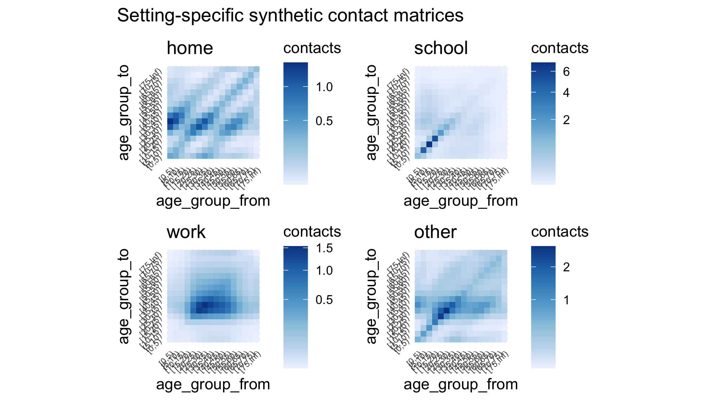

# Summary

[ A summary describing the high-level functionality and purpose of the software for a diverse, non-specialist audience. ]

This article introduces `conmat`, an R package which generates synthetic contact matrices.

There are currently few options for a user to generate their own synthetic contact matrices. 
Existing methods to generate synthetic contact matrices are not designed for replicability, do not have enough granularity, and does not cover enough administrative areas (in other words, some countries are not included).

[ What's different and useful about conmat? ] 
Users might have their own contact survey data that they would like to generate synthetic contact matrices from.
Perhaps the population demography is different, or the contact rates varying.
A higher level of granularity however is sometimes required to make public health decisions for a given population.

`conmat` also provides flexibility, in that it allows users to specify the area in which they would like the contact matrices to be generated; it allows users to specify their own age groups and population structures; it allows users to upload their own contact surveys to fit the model on; and it allows users to generate the contact matrices at different settings.

[ What else is covered in this paper? ] An example use-case for `conmat` is provided for a local government area (i.e. at the sub-national level) in Australia.
Also provided is an analysis pipeline to support conmat, [`syncomat`](https://github.com/idem-lab/syncomat), which generates synthetic contact matrices for 200 countries.

# Statement of need

[ A Statement of need section that clearly illustrates the research purpose of the software and places it in the context of related work. ]

#TODO - A better first sentence that encapsulates conmat use? 
Understanding the dynamics of infectious disease transmission is an important task (?) for epidemiologists and public policy makers.
Identifying vulnerable groups and predicting disease transmission (?)dynamics / how diseases spread are essential for informed public health decision-making. 
Infectious diseases such as influenza and coronavirus spread through human-to-human interactions, or in other words, "social contact". Quantifying social contact and its patterns can provide critical insights into how these diseases spread. [ Is this circular? ] / and how best to mitigate the spread of these diseases.

We can measure social contact through social contact surveys, where people describe the number and type of social contact they have. These surveys provide (?) a measure of contact rates: an empirical estimate of the number of social contacts from one age group to another and the setting of contact. For example, we might learn from a contact survey that homes have higher contact between 25-50 year olds and 0-15 year olds, whereas workplaces might have high contact within 25-60 year olds.

These social contact surveys exist for a few countries. As an example, the "POLYMOD" study by @mossong2008 covered 8 European countries: Belgium, Germany, Finland, Great Britain, Italy, Luxembourg, The Netherlands, and Poland [@mossong2008]. However, what do we do when we want to estimate contact rates in other countries where this is not yet measured? We can use existing data--the contact rates obtained from contact surveys--to help us project / predict these estimates to countries or places that do not have them. These are called "synthetic contact matrices". A popular approach by @prem2017 projected contact rates from the POLYMOD study to 152 countries. This was later updated to include synthetic contact matrices for 177 countries at "urban" and "rural" levels for each country [@prem2021]. 
[ #TODO is project or predict a better word? Does it matter? ]

However, there were major limitations with the methods in @prem2021. First, not all countries were included in their analyses. Second, some of the synthetic contact matrices did not have enough granularity; in other words, they covered areas that are too large, such as the "urban" or "rural" parts of a country. This is disadvantageous as public health groups might need to make predictions for more fine-grained areas within a country, such as a district or municipality. Third, the methodology used by Prem et al. was challenging to reuse in other contexts. Prem et al. provided the code used for their analysis, but that code was not designed for replicability and easy modification with user-defined inputs.

[REVISED PARAGRAPH BELOW] The `conmat` package was created to fill a specific need for creating synthetic contact matrices for specific local government areas for Australia, for work commissioned by the Australian government. We created methods and software to facilitate the following:

The `conmat` package was developed to fill the specific need of creating synthetic contact matrices for local government areas in Australia. This package is used for [ #TODO what work, specifically? Health? Provide example. Or is *this* package commissioned by the Aus govt? ] work commissioned by the Australian government.
We developed methods and software to facilitate the following tasks.

- Generate, as output, synthetic contact matrices from age-stratfied population data.
- Create next generation matrices (NGMs).
- Apply vaccination reduction to NGMs.
- Use NGMs in disease modelling.
- Provide tidied population data from the Australian Bureau of Statistics.

# Example

As an example, let us generate a contact matrix for a local government area within Australia, using a model fitted from the POLYMOD data.

Suppose we want to generate a contact matrix for the City of Perth. We can get the age-stratified population data for Perth from the helper function `abs_age_lga`:


``` r
library(conmat)
perth <- abs_age_lga("Perth (C)")
perth
```

```
#> # A tibble: 18 × 4 (conmat_population)
#>  - age: lower.age.limit
#>  - population: population
#>    lga       lower.age.limit  year population
#>    <chr>               <dbl> <dbl>      <dbl>
#>  1 Perth (C)               0  2020       1331
#>  2 Perth (C)               5  2020        834
#>  3 Perth (C)              10  2020        529
#>  4 Perth (C)              15  2020        794
#>  5 Perth (C)              20  2020       3615
#>  6 Perth (C)              25  2020       5324
#>  7 Perth (C)              30  2020       4667
#>  8 Perth (C)              35  2020       3110
#>  9 Perth (C)              40  2020       1650
#> 10 Perth (C)              45  2020       1445
#> 11 Perth (C)              50  2020       1299
#> 12 Perth (C)              55  2020       1344
#> 13 Perth (C)              60  2020       1359
#> 14 Perth (C)              65  2020       1145
#> 15 Perth (C)              70  2020       1004
#> 16 Perth (C)              75  2020        673
#> 17 Perth (C)              80  2020        481
#> 18 Perth (C)              85  2020        367
```

We can then generate a contact matrix for `perth` using the `extrapolate_polymod` function, where the contact matrix is generated using a model fitted from the POLYMOD data. 


``` r
perth_contact <- extrapolate_polymod(population = perth)
perth_contact
```

```
#> 
```

```
#> ── Setting Prediction Matrices ─────────────────────────────────────────────────
```

```
#> A list of matrices containing the model predicted contact rate between ages in
#> each setting.
```

```
#> There are 16 age breaks, ranging 0-75+ years, with a regular 5 year interval
```

```
#> • home: a 16x16 <matrix>
```

```
#> • work: a 16x16 <matrix>
```

```
#> • school: a 16x16 <matrix>
```

```
#> • other: a 16x16 <matrix>
```

```
#> • all: a 16x16 <matrix>
```

```
#> ℹ Access each <matrix> with `x$name`
```

```
#> ℹ e.g., `x$home`
```

We can plot the resulting contact matrix for Perth with `autoplot`:


``` r
autoplot(perth_contact)
```




# Implementation

`conmat` was built to predict at four settings: work, school, home, and other. 
One model is fitted for each setting. 
Each model fitted is a Poisson generalised additive model (GAM) which predicts the count of contacts, with an offset for the log of participants. 
The model has six (?)covariates/terms to explain six key features of the relationship between ages, 
and two optional terms for attendance at school or work.
The two optional terms are included depending on which setting the model is fitted for.

Each cell in the resulting contact matrix, indexed *i*, *j*, is the predicted number of people in age group *j* that a single individual in age group *i* will have contact with per day. If you sum across all the *j* age groups for each *i* age group, you get the predicted total number of contacts per day for each individual of age group *i*. [ #TODO expected, predicted, or average? Does it matter? ]

The six terms are 
$|i-j|$, 
${|i-j|}^{2}$, 
$i + j$, 
$i \times j$, 
$\text{max}(i, j)$ and 
$\text{min}(i, j)$.

The six key features of the relationship between the age groups, represented by the six terms, are displayed in the figure below. 
[ #TODO notes-to-self: the model structure wasn't generated through any particularly robust process, it was just coming up with structures that looked mildly appropriate for our use case. ]


``` r
# Show partial dep plot of the six main terms
```

Note that these partial dependency plots are on the log scale. 
When the six terms are added up together for each setting (in other words, each model) and exponentiated, they show the following patterns:


``` r
# Show combined partial dep plot (i.e. sum of the partial dependencies for all six terms) in each setting: home, school, work and other
```

In other words, the six terms above provide patterns that are useful in modelling the different settings,
and correspond with real-life situations of how contact would look like. 
In the home setting for example, [ #TODO describe how children interact with parents and elderly generation, grandparents ].
When the terms for school and work are added, these terms also provide patterns that correspond with real-life situations.
https://idem-lab.github.io/conmat/dev/articles/visualising-conmat.html
In the school setting, children tend to contact other children in the same age groups as them.
In the work setting, there are no contacts with children under the age of ten and minimal contact with adults beyond retirement age. 

One of the issues with the contact matrices generated by @prem2017 is that some countries are missing. To remedy this we generated synthetic contact matrices for 200 countries, based on a list of country names by the UN, fitted on the POLYMOD contact surveys.
We also ensured that the analysis pipeline is reproducible and transparent by utilising a targets workflow, which allows ease of editing for users.
The resulting synthetic contact matrices, and a replicable / extensible (?) analysis pipeline, can be found in the syncomat analysis pipeline ([GitHub](https://github.com/idem-lab/syncomat), [Zenodo](https://zenodo.org/records/11365943)).

## Model interfaces

We provide functions for model fitting at various use cases. Further detail for each of the following functions are available at: https://idem-lab.github.io/conmat/dev/

* `fit_single_contact_model()`
    * Fits a generalised additive model (GAM) using contact survey data and population size information. This function is recommended when you want to fit a model to only one setting, for which you might want to provide your own contact survey data.

* `predict_contacts()`

    * This takes a fitted model from `fit_single_contact_model()` and predicts [ #TODO what is predicted? ] to a provided (?) population structure.

* `fit_setting_contacts()`
    * Fits the `fit_single_contact_model()` to each setting. This function is useful for when you have multiple settings to fit. Returns a list of fitted models. 

* `predict_setting_contacts()`
    * Takes a list of fitted models from `fit_setting_contacts()` and predicts [ #TODO what is predicted? ] to a given population for each setting.

* `estimate_setting_contacts()`
    * A convenience function that fits multiple models, one for each setting. This means fitting `fit_setting_contacts()` and then `predict_setting_contacts()`. Recommended for when you have multiple settings to fit and want to predict to a given population as well.

* `extrapolate_polymod()`
    * Takes population information and projects pre-fit model from POLYMOD - used for speed when you know you want to take an already fit model from POLYMOD and just fit it to your provided population.

[ #TODO for the above it's good to explain what exactly is predicted. Otherwise it's confusing for the user to understand what each of the model outputs? ]

# Conclusions and future directions

Our future direction for `conmat` includes adding the following functionalities:
* Create a contact matrix using a custom contact survey from another source, such as the `socialmixr` R package.
* Predict to any age brackets - such as monthly ages, for example, 1, 3, 6, month year old infants
* Add ability to fit multiple contact surveys at once, e.g., POLYMOD and another dataset
* Add ability to include known household age distributions as offsets in the 'home' setting model, in place of the whole population distribution. So compute household age matrices (like age-structured contact matrices, but for household members instead of contacts) from POLYMOD data. If we compute a different one for each household size, in the POLYMOD data (probably estimated with another GAM, to make best use of the limited data) we might be able to extrapolate household age matrices to new countries based on the distribution of household sizes.
* Add methods for including household size distributions
* Add uncertainty to estimates
* Move Australian centric data into its own package
* Add documentation on specifying your own GAM model and using this workflow

[ #TODO Change concluding sentence. The following is copied ad verbatim from JSS bizicount because I like it ] For now, however, we feel that our base `bizicount` package is sufficiently general to assist in estimating the models most often encountered by applied researchers.

# References
